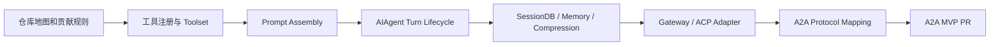
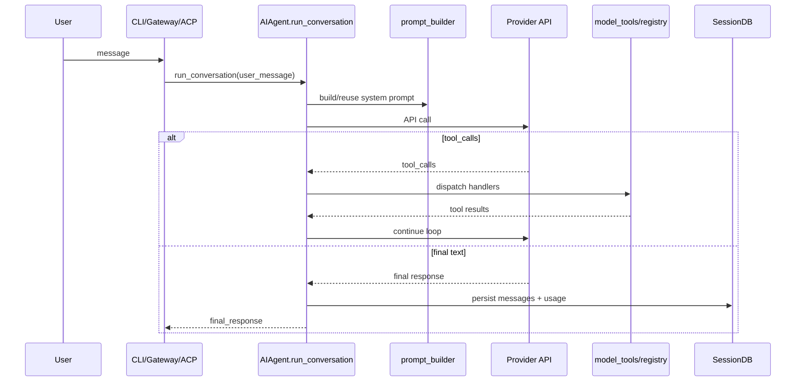

# Hermes 核心开发者学习计划

目标：系统性掌握 Hermes Agent 的源码结构、运行时模型、扩展机制和贡献流程，最终具备为 Hermes 增加 A2A 支持的能力。

默认前提：你 Python 能力足够强，且已经安装并长期使用 Hermes。因此本计划不花时间讲 Python 基础、安装配置和普通 CLI 使用。

## 总体策略

不要从 `run_agent.py` 直接开始。它是核心，但不是入口。更好的路线是：



理由：

- 工具体系最容易形成“源码 -> 行为 -> 测试”的闭环；
- Prompt 与 Tool 是理解 Agent Loop 的前置知识；
- Gateway/ACP 是实现 A2A 的直接参考范式；
- A2A 需要的是“协议适配层 + session/task 映射 + callback/stream bridge + auth/permission bridge”，不是直接改大模型调用逻辑。

## 学习产出规则

每个阶段都要有明确 artifact：

| artifact | 存放位置 | 标准 |
|---|---|---|
| 学习日志 | `journal/YYYY-MM-DD-*.md` | 记录本次目标、源码位置、结论、疑问、下一步 |
| 源码笔记 | `notes/source/*.md` | 至少包含入口、关键函数、数据结构、调用链、风险点 |
| Mermaid 图 | `docs/diagrams/*.md` | 流程性内容必须图示化 |
| ADR/设计草案 | `notes/design/*.md` | 涉及架构选择时必须写决策记录 |
| 验证动作 | commit / test / script | 每次学习至少一个可验证动作 |

## Phase 0：仓库定位与贡献边界

建议时间：2-3 天。

目标：建立 high-level 地图，知道每类问题该看哪里。

重点阅读：

- `README.md`
- `CONTRIBUTING.md`
- `pyproject.toml`
- `AGENTS.md`
- `docs/developer-guide/architecture`
- `tests/` 的目录结构

你需要回答：

1. Hermes 有哪些入口？CLI、Gateway、ACP、Cron、Batch、API Server 分别在哪里进入？
2. 哪些模块是“核心共享层”？哪些是“平台适配层”？
3. 新功能应该如何判断放在 skill、tool、plugin、gateway adapter、ACP adapter、provider plugin、agent loop 中？
4. CI 和本地测试的最小运行命令是什么？
5. 贡献时有哪些跨平台、安全、commit message 约束？

产出：

- `notes/source/00-repo-map.md`
- `docs/diagrams/00-hermes-system-map.md`
- commit：`docs(repo): map hermes architecture and contribution boundaries`

验收标准：

- 能不看文档说出 `run_agent.py`、`model_tools.py`、`toolsets.py`、`hermes_state.py`、`gateway/run.py`、`acp_adapter/server.py` 各自职责；
- 能解释为什么 A2A 不应该一开始就改 `AIAgent` 主循环；
- 能列出一个最小 PR 的测试命令和风险说明模板。

## Phase 1：从最容易闭环的 Tool System 开始

建议时间：4-6 天。

目标：掌握 Hermes 最清晰的一条扩展链：tool 文件自注册 -> registry -> tool definitions -> model tool call -> dispatch -> handler -> result。

重点源码：

```text
tools/registry.py
model_tools.py
toolsets.py
tools/approval.py
tools/terminal_tool.py
tools/file_tools.py
tests/test_*tool*.py
```

阅读顺序：

1. `tools/registry.py`：`ToolEntry`、`registry.register()`、`discover_builtin_tools()`、`registry.get_definitions()`、`registry.dispatch()`。
2. `model_tools.py`：`get_tool_definitions()`、`handle_function_call()`，重点看 schema 过滤、toolset 展开、错误包装。
3. `toolsets.py`：平台 preset 和 toolset 组合，尤其是 `hermes-cli`、`hermes-acp` 一类配置。
4. `tools/approval.py` + `tools/terminal_tool.py`：危险命令审批链，理解安全边界。

练习任务：

- 写一份工具注册流程图；
- 找一个简单工具，追踪它从 schema 到 handler 的完整路径；
- 在自己的 Hermes fork 中做一个不准备提交的实验性 toy tool，例如 `echo_json`，验证：注册、toolset 暴露、schema 出现在 model tools、handler 返回 JSON；
- 写一个最小 pytest，验证 handler 对非法参数返回可控错误。

产出：

- `notes/source/01-tool-runtime.md`
- `docs/diagrams/01-tool-dispatch-flow.md`
- `notes/design/adr-001-tool-vs-skill.md`
- commit：`docs(tools): document registry and dispatch lifecycle`

验收标准：

- 你能说明“为什么只写 `registry.register()` 还不够，还要接入 `toolsets.py`”；
- 能解释 `check_fn` 为什么要 fail-safe；
- 能判断一个能力应该实现为 skill 还是 tool。

## Phase 2：Prompt Assembly 与 Skills / Context Files

建议时间：4-5 天。

目标：掌握 Hermes 如何把身份、记忆、技能、项目上下文、平台提示组装成稳定 prompt，以及哪些内容是 cached、哪些是 ephemeral。

重点源码：

```text
agent/prompt_builder.py
agent/prompt_caching.py
agent/skill_commands.py
tools/memory_tool.py
skills/**/SKILL.md
optional-skills/**/SKILL.md
```

关键问题：

1. `SOUL.md`、`MEMORY.md`、`USER.md`、`.hermes.md`、`AGENTS.md` 的加载顺序是什么？
2. 为什么 prompt assembly 要区分 cached system prompt 和 API-call-time-only layers？
3. skill index 如何进入系统 prompt？
4. skill 的 frontmatter 如何影响可见性、平台限制、toolset 依赖？
5. 修改 `agent/prompt_builder.py` 和写 skill 的边界在哪里？

练习任务：

- 写一个学习用 Hermes skill：`hermes-source-reading`；
- 用 `.hermes.md` 固化你在学习 Hermes 源码时希望 Hermes 遵循的行为；
- 做一次 prompt 入口链路图：`AIAgent` 初始化 -> prompt builder -> context files -> skills index。

产出：

- `notes/source/02-prompt-assembly.md`
- `skills/hermes-source-reading/SKILL.md`
- `docs/diagrams/02-prompt-layers.md`
- commit：`docs(prompt): map prompt layers and skill context flow`

验收标准：

- 能解释为什么 mid-session memory 写入不会立刻改变已缓存 system prompt；
- 能判断“用户想改变行为”时该改 `SOUL.md`、项目 context、skill，还是 Python 源码。

## Phase 3：AIAgent Turn Lifecycle，开始进入核心循环

建议时间：7-10 天。

目标：读懂核心 agent loop 的主路径，不追求每行代码，而是掌握状态机、消息格式、工具调用、回调、重试、fallback、压缩与持久化触发点。

重点源码：

```text
run_agent.py
agent/anthropic_adapter.py
agent/auxiliary_client.py
agent/context_engine.py
agent/context_compressor.py
agent/prompt_caching.py
agent/model_metadata.py
model_tools.py
```

阅读方法：不要线性读 15k 行。按调用链切片：

1. `AIAgent.__init__`：运行时依赖、provider、tools、callbacks、session id；
2. `chat()`：薄封装；
3. `run_conversation()`：主 turn lifecycle；
4. API message 构造：chat completions / codex responses / anthropic messages；
5. tool call branch：并发工具、interactive tool、agent-level tool；
6. fallback branch：什么时候换 provider/model；
7. compression branch：什么时候压缩、如何保护最后 N 条消息；
8. persistence branch：何时写 SessionDB、何时 flush memory。

建议画图：



练习任务：

- 选择一个真实 Hermes 对话，打开 debug/log，映射到源码路径；
- 写一份“消息格式不变量”笔记：role alternation、tool call/result pair、reasoning fields；
- 写一份“不要破坏的核心不变量”清单。

产出：

- `notes/source/03-agent-loop.md`
- `checklists/agent-loop-invariants.md`
- commit：`docs(agent): document turn lifecycle and invariants`

验收标准：

- 能解释三种 API mode 的差异和最终如何汇合到内部 OpenAI-style message format；
- 能指出 A2A adapter 应该调用 `AIAgent.run_conversation()` 的哪种形式；
- 能解释 callback surfaces 为什么是实现 ACP/A2A streaming 的关键。

## Phase 4：SessionDB、Memory、Compression 与可恢复性

建议时间：5-7 天。

目标：理解 Hermes 如何持久化 session、message、FTS、lineage、compression child session。A2A 的 `contextId`、`taskId` 很可能要映射到这里。

重点源码：

```text
hermes_state.py
agent/context_compressor.py
agent/memory_manager.py
agent/memory_provider.py
plugins/memory/**
gateway/session.py
```

关键问题：

1. `sessions`、`messages`、FTS5 表如何关联？
2. `parent_session_id` 如何表达压缩后的 lineage？
3. gateway session key 和 CLI session id 的差异是什么？
4. 并发写如何处理？为什么要 WAL、短 timeout、应用层 jitter？
5. A2A `contextId` 应映射到 Hermes session、gateway session key，还是单独表？

练习任务：

- 写一个只读脚本，列出最近 session、message count、tool call count；
- 手工运行一次 session search，追踪到 FTS 查询；
- 设计一个 A2A task/session mapping 草案。

产出：

- `notes/source/04-sessiondb-memory-compression.md`
- `notes/design/adr-002-a2a-task-session-mapping.md`
- commit：`docs(state): map session storage and a2a task implications`

验收标准：

- 能解释为什么 Cron job deliveries 不应混入普通 gateway session history；
- 能提出 A2A `Task` 与 Hermes `SessionDB` 的持久化方案，并说明取舍。

## Phase 5：Gateway Internals，理解多平台适配层

建议时间：6-8 天。

目标：掌握 Gateway 如何把不同聊天平台统一为 `MessageEvent`，如何做授权、session routing、active-session guard、delivery、hooks、cron tick。

重点源码：

```text
gateway/run.py
gateway/platforms/base.py
gateway/platforms/webhook.py
gateway/platforms/api_server.py
gateway/session.py
gateway/delivery.py
gateway/pairing.py
gateway/hooks.py
gateway/status.py
hermes_cli/gateway.py
```

阅读顺序：

1. `gateway/platforms/base.py`：adapter interface、active sessions、pending messages；
2. 某个简单 adapter：`webhook.py` 或 `api_server.py`；
3. `gateway/run.py._handle_message()`：session key、authorization、slash command、agent creation；
4. `gateway/delivery.py`：响应如何发回目标平台；
5. hooks 与 background maintenance。

练习任务：

- 画 Gateway message flow；
- 找一个 adapter，写一份“平台事件 -> MessageEvent -> AIAgent -> delivery”的追踪笔记；
- 设计 A2A 作为 gateway platform adapter 的优缺点。

产出：

- `notes/source/05-gateway-internals.md`
- `docs/diagrams/05-gateway-message-flow.md`
- `notes/design/adr-003-a2a-as-gateway-adapter-or-separate-adapter.md`
- commit：`docs(gateway): analyze adapter and session routing flow`

验收标准：

- 能解释两级 running-agent guard；
- 能判断 A2A 是否复用 GatewayRunner，或像 ACP 一样作为独立 adapter 更合适。

## Phase 6：ACP Adapter，A2A 最重要的参考实现

建议时间：6-8 天。

目标：读懂一个“协议适配层如何包住同步 AIAgent 并暴露异步协议服务”的完整范式。这是实现 A2A 的直接模板。

重点源码：

```text
acp_adapter/entry.py
acp_adapter/server.py
acp_adapter/session.py
acp_adapter/events.py
acp_adapter/permissions.py
acp_adapter/tools.py
acp_adapter/auth.py
acp_registry/agent.json
tests/acp/**
toolsets.py
```

关键问题：

1. ACP 如何启动？为什么 stdout 只能给 JSON-RPC transport，日志走 stderr？
2. `HermesACPAgent` 负责哪些 protocol methods？
3. `SessionManager` 如何维护 live session、cwd、history、cancel_event？
4. 同步 `AIAgent` 如何在线程池中运行，并通过 `asyncio.run_coroutine_threadsafe` 把 callback 变成 async event？
5. permission bridge 如何映射危险命令审批？
6. `hermes-acp` toolset 为什么需要定制？

练习任务：

- 写 ACP boot/session/event/permission 四张小图；
- 仿照 ACP 写 A2A adapter 的模块草图；
- 列出 A2A 和 ACP 的差异：transport、discovery、task lifecycle、streaming、auth、artifact。

产出：

- `notes/source/06-acp-adapter.md`
- `docs/diagrams/06-acp-bridge-flow.md`
- `ROADMAP_A2A.md` 初版补全
- commit：`docs(acp): derive adapter pattern for a2a design`

验收标准：

- 能说清“worker thread 中跑 AIAgent，main event loop 发协议事件”的桥接模型；
- 能将 `step_callback`、`tool_progress_callback`、approval callback 映射到 A2A TaskStatusUpdateEvent 或 auth-required state。

## Phase 7：Provider Runtime 与插件边界

建议时间：4-5 天。

目标：理解 provider runtime 只是模型调用的共享解析层，不应让 A2A 复制认证/模型选择逻辑。

重点源码：

```text
hermes_cli/runtime_provider.py
hermes_cli/auth.py
hermes_cli/model_switch.py
agent/auxiliary_client.py
providers/**
plugins/model-providers/**
```

关键问题：

1. provider/model 优先级：显式请求、config、env、provider default；
2. native Anthropic / Codex Responses / OpenAI-compatible 的分流；
3. fallback providers 如何触发；
4. A2A server 应该复用 Hermes 当前 provider，还是为每个 remote client 支持 provider override？

产出：

- `notes/source/07-provider-runtime.md`
- `notes/design/adr-004-a2a-provider-policy.md`
- commit：`docs(provider): map runtime resolution for adapter reuse`

验收标准：

- 能解释 A2A adapter 为什么不应该自己读取 API key 或创建 provider client；
- 能设计 remote A2A request 中模型选择的允许/禁止策略。

## Phase 8：A2A 协议专题学习与 Hermes 映射

建议时间：5-7 天。

目标：掌握 A2A 的核心对象、操作、协议绑定、安全要求，并做 Hermes 适配设计。

A2A 需要关注：

```text
AgentCard
AgentSkill
Message / Part / Artifact
Task / TaskStatus / TaskState
SendMessage
SendStreamingMessage
GetTask / ListTasks / CancelTask
SubscribeToTask
Push Notification Config
HTTP+JSON/REST binding
JSON-RPC binding
Security Schemes
```

Hermes 映射重点：

| A2A 概念 | Hermes 可能映射 |
|---|---|
| AgentCard | 配置生成的 public metadata + skills/toolsets 摘要 |
| AgentSkill | Hermes skills / toolsets / platform capabilities 的公开子集 |
| SendMessage | 创建/复用 A2A session，调用 `AIAgent.run_conversation()` |
| SendStreamingMessage | 将 AIAgent callbacks 转为 SSE stream events |
| Task | A2A task table 或 SessionDB metadata 扩展 |
| TaskStatus | running/completed/failed/canceled/auth_required 映射 |
| Artifact | final response、文件输出、structured result |
| CancelTask | `agent.interrupt()` + task state transition |
| Auth Required | Hermes approval/clarify/security callbacks 的协议化表达 |
| Context | Hermes session id / gateway session key / A2A context id 映射 |

产出：

- `notes/design/a2a-hermes-mapping.md`
- `docs/diagrams/08-a2a-hermes-mapping.md`
- commit：`docs(a2a): map protocol objects to hermes runtime`

验收标准：

- 能写出 A2A MVP 的 method list；
- 能说明哪些功能先不做：push notifications、signed card、file upload、多绑定支持等；
- 能给出兼容未来扩展的最小数据模型。

## Phase 9：A2A Spike：独立适配层，不污染核心

建议时间：7-10 天。

目标：在 fork 里实现一个不追求完整协议覆盖的 spike，证明 Hermes 能作为 A2A Server 接收 message 并返回 task/message。

建议模块草图：

```text
a2a_adapter/
├── __init__.py
├── entry.py          # hermes a2a serve / hermes-a2a
├── server.py         # FastAPI or JSON-RPC/HTTP server glue
├── card.py           # AgentCard generation
├── models.py         # protocol model subset; later replace/align with official SDK/proto
├── session.py        # task/context/session manager
├── events.py         # AIAgent callbacks -> A2A stream updates
├── auth.py           # initial bearer/api-key policy
├── permissions.py    # approval bridge -> auth_required / failure
└── tests/
```

MVP scope：

- `GET /.well-known/agent-card.json`
- `POST /message:send`
- `POST /message:stream`，可先只做 text/event-stream 的最小状态更新
- `GET /tasks/{id}`
- `POST /tasks/{id}:cancel`

不要先做：

- gRPC binding；
- full push notification config；
- extended agent card；
- JWS card signing；
- file upload/download；
- complex multimodal artifacts。

Spike 验收：

- curl 能拿到 agent card；
- curl 能 `POST /message:send` 并得到 `Task` 或 `Message`；
- streaming 能收到至少 `submitted/working/completed`；
- cancel 能触发 `agent.interrupt()`；
- 不破坏现有 CLI/Gateway/ACP 测试。

产出：

- fork 中最小 spike branch：`feat/a2a-spike`
- 本仓库记录：`notes/design/a2a-spike-retrospective.md`
- commit：`docs(a2a): record spike behavior and open questions`

## Phase 10：A2A MVP PR 级设计

建议时间：7-14 天。

目标：把 spike 收敛成可提交上游讨论的设计，而不是直接扔大 PR。

PR 前必须有：

1. 架构设计：为什么独立 `a2a_adapter/`，和 Gateway/ACP 的关系；
2. 协议覆盖范围：MVP 支持哪些 operation，不支持哪些；
3. 安全策略：认证、授权、暴露的 skills/capabilities、任务访问隔离；
4. 状态模型：task/context/session 的持久化位置；
5. Streaming 策略：callbacks 到 SSE 的映射；
6. 测试计划：unit + integration + no-network + cross-platform；
7. 迁移/配置：`pyproject.toml` optional extra、entrypoint、CLI subcommand、docs。

建议 PR 拆分：

| PR | 内容 | 风险 |
|---|---|---|
| PR 1 | A2A protocol models + AgentCard generator + tests | 低 |
| PR 2 | A2A session/task manager + persistence tests | 中 |
| PR 3 | `message:send` non-streaming server | 中 |
| PR 4 | streaming + cancellation + permission bridge | 高 |
| PR 5 | CLI command + docs + examples | 中 |

产出：

- `notes/design/a2a-mvp-design.md`
- `checklists/a2a-pr-readiness.md`
- commit：`docs(a2a): prepare mvp proposal and pr decomposition`

## 核心开发者能力检查表

当下面这些你都能做到，就基本达到了“可以参与核心开发”的水平：

- [ ] 能从 issue 快速定位它属于 CLI / Gateway / ACP / Tools / Agent / Provider / State / Skill 的哪一层；
- [ ] 能在不读完全仓库的情况下画出涉及模块的调用链；
- [ ] 能写出包含不变量、风险、测试范围的设计说明；
- [ ] 能判断改动是否会破坏 prompt cache、message alternation、tool call pairing、session lineage、gateway running-agent guard；
- [ ] 能为新 tool、新 skill、新 adapter、新 provider plugin 分别写合适测试；
- [ ] 能处理跨平台问题，尤其是 Windows process/path/encoding/signal；
- [ ] 能把一个大功能拆成上游容易 review 的 3-5 个 PR；
- [ ] 能对 A2A 的 server/client、task、stream、auth、agent card 做清晰映射。
