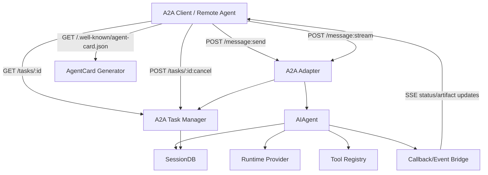
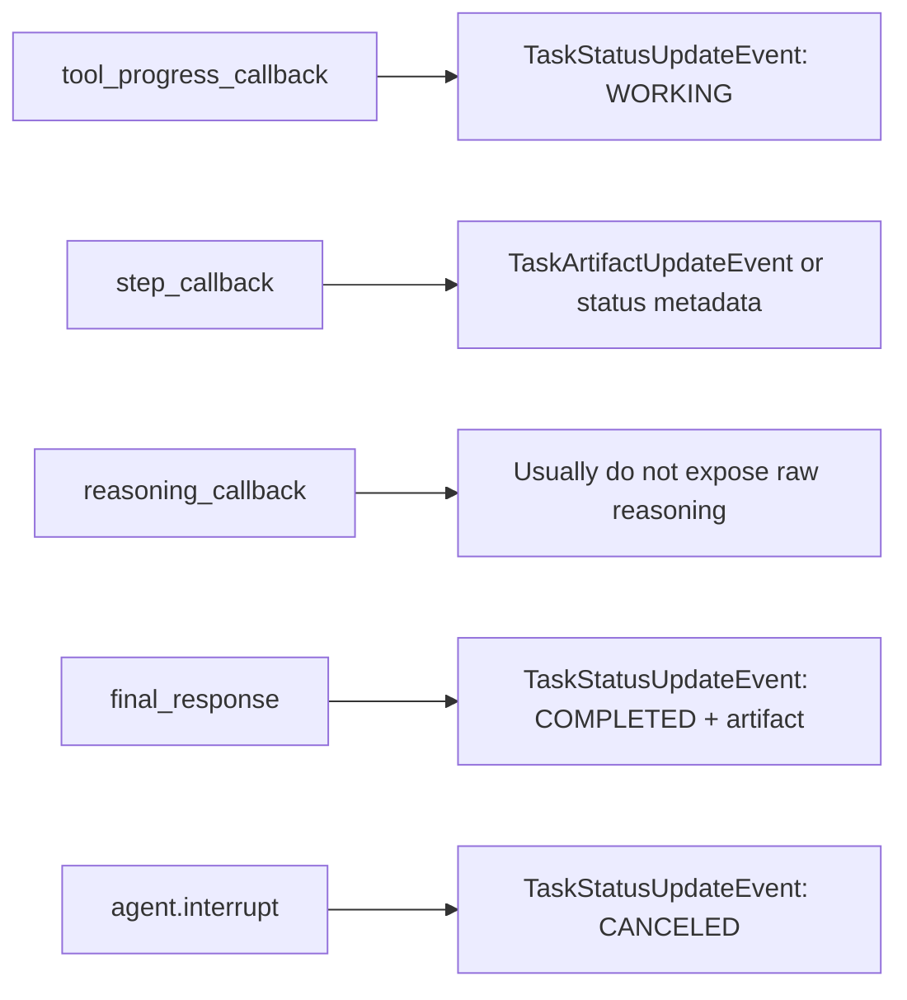

# Hermes A2A Support Roadmap

目标：为 Hermes 增加 Agent2Agent（A2A）协议能力，使 Hermes 可以作为 A2A Server 被其他 agent 调用，并在后续支持 Hermes 作为 A2A Client 调用其他 agent。

## 设计判断

A2A 不应首先改 `AIAgent` 主循环。更稳妥路径是新增协议适配层，复用现有核心：



## 为什么 ACP 是最近的参考

ACP 已经解决了一个关键问题：如何把 Hermes 的同步 `AIAgent` 包装成异步协议服务。

A2A 可以参考 ACP 的这些模式：

| ACP 模式 | A2A 对应 |
|---|---|
| `HermesACPAgent` protocol methods | A2A HTTP/JSON 或 JSON-RPC methods |
| `SessionManager` | A2A `TaskManager` + `ContextManager` |
| `events.py` callback bridge | SSE `TaskStatusUpdateEvent` / `TaskArtifactUpdateEvent` |
| `permissions.py` approval bridge | `TASK_STATE_AUTH_REQUIRED` 或 rejected/failed |
| tool rendering helpers | A2A Artifact / Part rendering |
| reuse runtime provider | A2A server 复用 Hermes 当前 provider/auth |

## MVP 协议范围

第一版只做 Server，不做 Client。

### 必须支持

- `GET /.well-known/agent-card.json`
- `POST /message:send`
- `POST /message:stream`
- `GET /tasks/{id}`
- `GET /tasks?contextId=...`
- `POST /tasks/{id}:cancel`

### 暂缓支持

- gRPC binding；
- JSON-RPC binding，除非上游更偏好 JSON-RPC；
- push notification config；
- signed Agent Card；
- authenticated extended Agent Card；
- full file upload/download；
- multi-modal native routing；
- Hermes as A2A Client。

## 模块草图

```text
a2a_adapter/
├── __init__.py
├── entry.py          # hermes a2a serve / hermes-a2a
├── server.py         # HTTP+JSON/REST binding; likely FastAPI if accepted
├── card.py           # public AgentCard generation
├── models.py         # minimal protocol models or official SDK wrapper
├── session.py        # TaskManager / ContextManager / state transitions
├── events.py         # AIAgent callbacks -> A2A events
├── auth.py           # bearer/api-key policy; no provider key handling
├── permissions.py    # terminal approval / clarify / auth_required bridge
├── artifacts.py      # final response / files / structured result mapping
└── tests/
```

## A2A 与 Hermes 数据模型映射

| A2A | Hermes | 设计建议 |
|---|---|---|
| `AgentCard.name` | Hermes profile/display name | 从 config 生成，允许 override |
| `AgentCard.skills` | skills + selected toolsets | 默认只暴露安全高层能力，不暴露内部工具细节 |
| `Message.role=ROLE_USER` | OpenAI-style `user` message | text part 先支持，file/data part 后续扩展 |
| `Message.role=ROLE_AGENT` | final assistant response | 转为 text part 或 artifact |
| `Part.text` | message content | 第一版主路径 |
| `Part.file` | file reference | 第二阶段，必须解决安全边界 |
| `Part.data` | structured JSON | 可作为 advanced MVP+ |
| `Task.id` | A2A task id | 单独生成 UUID，映射 Hermes session/task |
| `Task.contextId` | Hermes session / gateway session key | 建议单独映射，不直接暴露 Hermes internal id |
| `TaskState.SUBMITTED` | task accepted | HTTP request 进入队列/线程前 |
| `TaskState.WORKING` | AIAgent running | thinking/tool_progress callback |
| `TaskState.COMPLETED` | final_response returned | 写 artifact/message |
| `TaskState.CANCELED` | agent interrupt | cancel endpoint |
| `TaskState.FAILED` | exception or agent error | sanitized error |
| `TASK_STATE_AUTH_REQUIRED` | approval/clarify needed | 后续支持；MVP 可先 fail/unsupported |

## 关键设计风险

### 1. Session 与 Task 的边界

Hermes session 是对话历史；A2A task 是工作单元。不要简单把 task id 等同 session id。推荐：

```text
contextId -> logical conversation context
sessionId -> internal Hermes session / state.db record
taskId    -> one A2A operation, can belong to a context/session
```

这样未来支持 multi-turn A2A 更自然。

### 2. Streaming 粒度

AIAgent callback 并不等于 A2A event。需要定义转换：



注意：不要暴露模型私有推理。只暴露用户可见 progress/status。

### 3. AgentCard 不应泄露内部实现

AgentCard 应描述 capability，不应公开私有路径、API key、完整 tool list、内部 prompt、用户 memory。

### 4. Auth 与 permission

A2A server 是远程入口，默认必须保守：

- 默认关闭，显式启用；
- 默认要求 bearer token 或本地 only；
- destructive tool approval 仍需走 Hermes 现有审批；
- remote client 不应绕过 Gateway/CLI 的安全策略；
- task access 必须按 client identity/context 隔离。

## MVP PR 拆分

### PR 1：Protocol models and card generator

内容：

- `a2a_adapter/models.py` 或官方 SDK wrapper；
- `a2a_adapter/card.py`；
- config defaults；
- tests for public card generation。

验收：

- 不启动 agent 也能生成 AgentCard；
- 不泄露 secrets；
- skills/capability 输出可配置。

### PR 2：Task manager

内容：

- task/context/session mapping；
- task state transitions；
- in-memory first，或 SQLite-backed minimal storage；
- tests for create/get/list/cancel state。

验收：

- 并发安全；
- task id 不等于 internal session id；
- terminal state 不再接收 new message。

### PR 3：Non-streaming `message:send`

内容：

- HTTP endpoint；
- request validation；
- text part -> AIAgent message；
- final response -> A2A Message/Task。

验收：

- curl E2E；
- no provider override leakage；
- errors sanitized。

### PR 4：Streaming and cancellation

内容：

- SSE stream；
- callback bridge；
- cancel endpoint -> `agent.interrupt()`；
- task status updates。

验收：

- stream closes on terminal state；
- cancel idempotent；
- duplicate/cancel races tested。

### PR 5：CLI, docs, examples

内容：

- `hermes a2a serve`；
- pyproject optional extra/script；
- docs page；
- example curl and sample client。

验收：

- install extra works；
- docs include security warning；
- no regressions in CLI/Gateway/ACP。

## A2A readiness milestones

你具备实现 A2A 的条件是：

- [ ] 能解释 ACP adapter 的 session/event/permission bridge；
- [ ] 能解释 Gateway 的 session key 与 authorization；
- [ ] 能解释 AIAgent callbacks 和 interrupt；
- [ ] 能解释 SessionDB 写入、lineage、FTS；
- [ ] 能设计 A2A task/context/session mapping；
- [ ] 能写不暴露内部工具和 memory 的 AgentCard；
- [ ] 能为 streaming、cancel、auth、error state 写测试。
