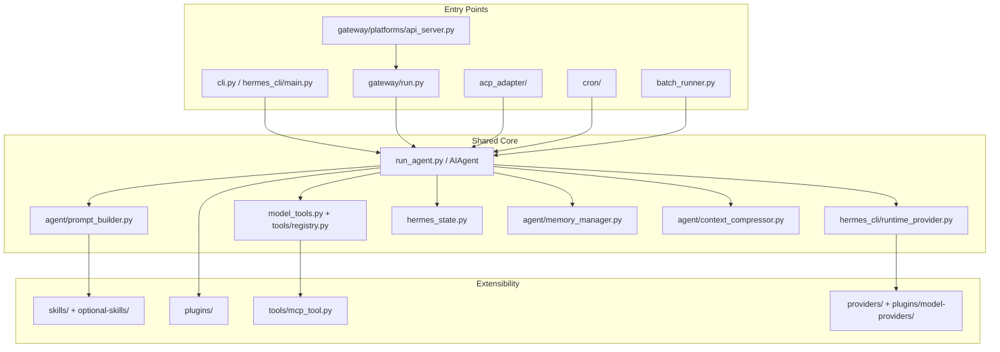

# Hermes Source Map

这份地图用于快速定位 Hermes 源码，不替代源码阅读。

## 顶层系统图

## 入口层

| 模块 | 角色 | 学习重点 |
|---|---|---|
| `hermes_cli/main.py` | `hermes` 命令入口 | subcommand 路由、setup/model/tools/gateway 命令 |
| `cli.py` | 交互式 CLI/TUI | 用户输入、slash command、streaming display |
| `gateway/run.py` | 多平台消息网关 | message dispatch、authorization、session routing、cron tick |
| `acp_adapter/server.py` | ACP 协议 server | async 协议包装 sync AIAgent |
| `batch_runner.py` | 批量轨迹生成 | 训练/评估路径 |
| `mcp_serve.py` | MCP 暴露路径 | 工具/服务互操作 |

## 核心层

| 模块 | 角色 | 不变量 |
|---|---|---|
| `run_agent.py` | Agent 主循环 | message alternation、tool pair、interrupt、fallback、persistence |
| `agent/prompt_builder.py` | Prompt 拼装 | cached prompt 稳定、context loading priority |
| `model_tools.py` | tool schema/filter/dispatch | toolset 过滤、error wrapping、agent-level tool intercept |
| `tools/registry.py` | tool 注册中心 | top-level register auto discovery、check_fn fail-safe |
| `toolsets.py` | toolset/preset | 新 tool 必须暴露到合适 toolset |
| `hermes_state.py` | SQLite session store | WAL、FTS、lineage、migration idempotence |
| `hermes_constants.py` | profile-aware path | 多 profile 隔离 |
| `agent/context_compressor.py` | 压缩 | 保护最近消息、tool pairs 不拆分 |
| `agent/auxiliary_client.py` | 辅助模型调用 | 与主 provider 分离但共享 runtime resolution |

## Gateway 层

| 模块 | 角色 |
|---|---|
| `gateway/platforms/base.py` | adapter 基类，active session guard |
| `gateway/session.py` | session key 构造和持久化协调 |
| `gateway/delivery.py` | outbound delivery |
| `gateway/pairing.py` | 用户授权 pairing |
| `gateway/hooks.py` | gateway lifecycle hooks |
| `gateway/status.py` | profile-scoped PID/token lock |
| `gateway/platforms/webhook.py` | 简单 HTTP 平台适配参考 |
| `gateway/platforms/api_server.py` | REST API server adapter 参考 |

## ACP 层

| 模块 | 角色 | A2A 启发 |
|---|---|---|
| `acp_adapter/entry.py` | 启动和 transport 约束 | A2A 也应明确 stdout/logging/serve 模式 |
| `acp_adapter/server.py` | protocol methods | A2A operations 可以类似组织 |
| `acp_adapter/session.py` | live session manager | A2A task/session manager 参考 |
| `acp_adapter/events.py` | callback -> event bridge | A2A SSE streaming 参考 |
| `acp_adapter/permissions.py` | dangerous command approval bridge | A2A auth_required/permission mapping 参考 |
| `acp_adapter/tools.py` | tool result rendering | A2A Artifact rendering 参考 |
| `acp_adapter/auth.py` | 复用 runtime provider | A2A 不应复制 provider auth |

## 推荐阅读顺序

## 不要一开始深挖的区域

这些区域重要，但不适合作为第一入口：

- `run_agent.py` 全量线性阅读；
- RL / Atropos 环境；
- 所有 gateway platform adapter；
- 所有 provider plugin；
- dashboard/web 前端；
- 语音、多媒体、复杂 browser backend。

先建立主干，再按贡献目标深入。
