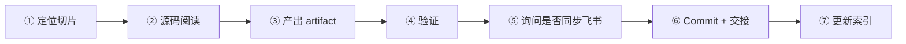

# Hermes-Relay 学习标准 Workflow

> 版本：v4，2026-05-16

## 总原则

每次会话 = 一个学习切片。有明确入口、有具体产出、有验证动作、有交接点。
Mermaid 是笔记中的表达形式，不是独立 artifact。
笔记结构不强制统一模板，按内容自然组织，但必须落到具体源码。
不以时间度量进度，以产出物的完备性和质量判定。

**计划可修订**：repo 中的学习方案不是固定路线。在逐步学习过程中，如果发现更合理的路径、顺序、或切分方式，主动提出，经 Master 确认后更新 repo 中的 LEARNING_PLAN.md 等规划文档。

## 流程



## ① 定位切片

明确三件事：

- **阶段来源**：`LEARNING_PLAN.md` 的哪个 Phase
- **要回答的问题**：一个具体的、可验证的问题
- **目标文件**：3-6 个紧密相关的源码文件，提前列出

**完成判定**：一句话说清本次要回答的问题，并列出目标文件。如果说不清，说明切片太大，需要拆分。

## ② 源码阅读

按切片阅读，不线性精读。关注：

1. 入口函数 → 签名、参数、返回值
2. 数据结构 → 核心类/Model 字段和约束
3. 调用链 → 从入口到出口的关键路径
4. 不变量 → 这段代码隐含的、不能破坏的约束
5. 错误处理 → 异常路径、fallback、边界情况
6. A2A 视角 → 对 A2A adapter 设计的启示

切片外的有趣发现：记一行到 `open-questions.md`，不展开。

**范围约束**：3-6 个紧密相关文件，不跨 Phase。

## ③ 产出 Artifact

每次至少产出 **1 个核心 artifact**：

| 类型 | 说明 | 存放 |
|---|---|---|
| 源码笔记 | 源码事实、调用链、Mermaid 图、不变量、风险 | `notes/source/*.md` |
| 设计笔记 | 架构选择、协议映射、trade-off | `notes/design/*.md` |
| Journal | 本次切片记录（无人值守必须，在场可选） | `journal/YYYY-MM-DD-*.md` |

**笔记原则**：

- 结构自由，按内容自然组织
- 不凑空 section，有内容才写
- Mermaid 内嵌在笔记中，靠近对应描述
- 不在 `docs/diagrams/` 新建独立 diagram 文件
- 必须落到具体源码（文件、函数、行号、调用链）

**完成判定**：笔记中至少包含一个具体的调用链或不变量，且经过验证。

## ④ 验证

每个切片至少一个验证动作，按优先级：

1. **运行测试**：`pytest tests/test_xxx.py -k "specific" -v`
2. **只读脚本**：rg 确认函数签名、调用关系
3. **对图审计**：用 rg 确认图中每个节点在源码中确实存在

**完成判定**：验证结果记录在笔记中，明确标注验证了什么、结果是什么。

## ⑤ 同步飞书

**在场模式**：完成产出后，询问 Master 是否需要推送到飞书。
**无人值守模式**：核心产出自动推送。

推送策略：

- 源码/设计笔记 → 飞书文档（Markdown 写入）
- Journal → 重要切片推送
- Mermaid 图 → 文本描述 + 标注"建议本地查看原图"

默认存放位置：[待 Master 指定 folder token 或 wiki space ID]

## ⑥ Commit + 交接

```bash
cd /home/shq/opensource/hermes-relay
git add -A
git -c user.name="shq" -c user.email="shq@originqc.com" commit -m "docs(phase-N): <concrete description>"
git push origin main
```

Commit message 格式：`docs(phase-N): <具体描述>`

交接写在笔记末尾：

```text
本次回答了：[问题]
下一次应从 [文件:函数] 继续，回答 [具体问题]
```

**完成判定**：已 push，笔记末尾有明确的交接信息。

## ⑦ 更新索引

每次产出笔记后，更新知识索引（`notes/INDEX.md`），记录：

- 新增/更新的笔记及其覆盖的源码模块
- 与已有笔记的关联关系（前置依赖、延伸、交叉引用）
- 当前进度（哪些 Phase 的笔记已建立，哪些还是空缺）

**完成判定**：INDEX.md 反映了本次新增/更新的笔记及其关联。

## 两种工作模式

### 在场模式（Master 在场）

- 实时讨论，边读边聊
- Master 可随时纠正方向、深入某个细节
- Journal 可选（如讨论过程有重要发现则记录）
- 飞书推送前询问 Master

### 无人值守模式（Master 离线）

遵守 `AGENTS.md` 无人值守规则：

- 每次只推进一个小切片
- 开始前声明切片来源和选择原因
- 优先产出二次学习材料，不改上游源码
- 必须产出 journal + 至少一份笔记
- Mermaid 内嵌在主题笔记中
- 必须包含验证动作
- 发现偏差以源码为准并记录
- 核心产出自动推送飞书
- 自动更新知识索引

输出格式：

```text
本次切片：
阶段来源：
阅读源码：
调用链：
关键不变量：
Mermaid 图：
验证动作：
发现的偏差：
风险：
产出文件：
下一次继续：
```

## 不做什么

- ❌ 不写"概念总结"式笔记——必须落到具体源码
- ❌ 不以时间度量进度
- ❌ 不一次性跨多个 Phase
- ❌ 不复制粘贴大段源码——只引关键片段 + 行号
- ❌ 不在没有验证的情况下声称"理解了"
- ❌ 不在 `docs/diagrams/` 新建独立 diagram 文件
