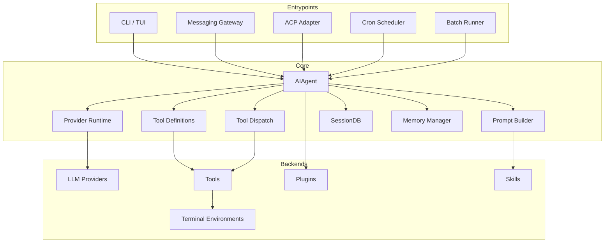

# Hermes System Map

```mermaid
flowchart TB
    subgraph Entrypoints
        CLI[CLI / TUI]
        Gateway[Messaging Gateway]
        ACP[ACP Adapter]
        Cron[Cron Scheduler]
        Batch[Batch Runner]
    end

    subgraph Core
        Agent[AIAgent]
        Prompt[Prompt Builder]
        Runtime[Provider Runtime]
        ToolDefs[Tool Definitions]
        Dispatch[Tool Dispatch]
        State[SessionDB]
        Memory[Memory Manager]
    end

    subgraph Backends
        Providers[LLM Providers]
        Tools[Tools]
        Env[Terminal Environments]
        Plugins[Plugins]
        Skills[Skills]
    end

    CLI --> Agent
    Gateway --> Agent
    ACP --> Agent
    Cron --> Agent
    Batch --> Agent

    Agent --> Prompt
    Agent --> Runtime
    Agent --> ToolDefs
    Agent --> Dispatch
    Agent --> State
    Agent --> Memory

    Runtime --> Providers
    ToolDefs --> Tools
    Dispatch --> Tools
    Tools --> Env
    Prompt --> Skills
    Agent --> Plugins
```
