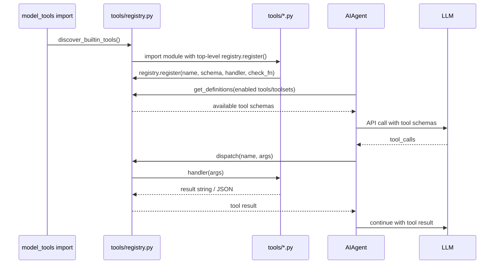

# Tool Dispatch Flow

关键不变量：

- 新 tool 的 `registry.register()` 必须在模块 top-level；
- 只注册不够，还要加入 `toolsets.py`；
- `check_fn` 出错视为 unavailable；
- tool handler 应返回字符串，通常是 JSON 字符串；
- 异常必须包装成模型可读的 JSON error，而不是炸出 agent loop。
