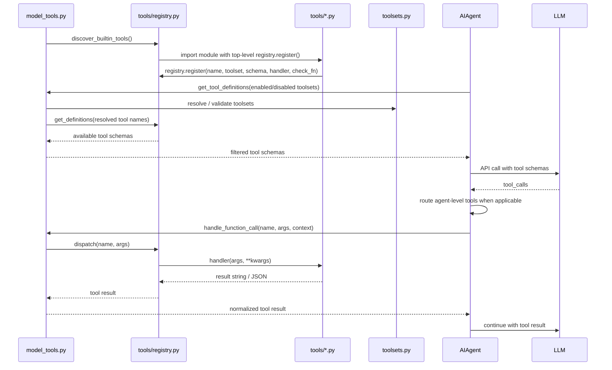

# Tool Dispatch Flow

关键不变量：

- 新 tool 的 `registry.register()` 必须在模块 top-level；
- 只注册不够，还要能被 toolset 解析/暴露；内置 tool 通常归属一个 `Toolset`，插件也可以注册 toolset；
- `AIAgent` 不直接向 registry 要 tool schema，也不直接对普通 registry tool 做 dispatch；中间层是 `model_tools.py`；
- `todo`、`memory`、`session_search`、`delegate_task` 等 agent-level tool 会在 `run_agent.py` 内部先被截获处理；
- `check_fn` 出错视为 unavailable；
- tool handler 应返回字符串，通常是 JSON 字符串；
- 异常必须包装成模型可读的 JSON error，而不是炸出 agent loop。
