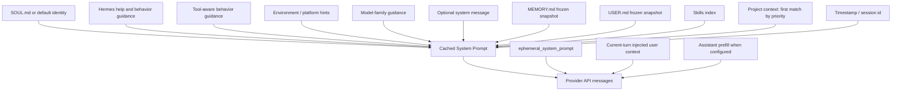

# Prompt Layers

注意：

- 项目上下文不是全部叠加；源码按优先级取第一个匹配来源：`.hermes.md`/`HERMES.md`，否则 `AGENTS.md`，否则 `CLAUDE.md`，否则 Cursor rules。
- Honcho 不是当前 prompt 的静态层；源码中 Honcho toolset 已移除，相关能力现在更接近 memory provider/plugin 集成。
- mid-session memory 写入更新磁盘，但通常不改变当前 session 已构建的 cached prompt，除非新 session 或强制 rebuild。
- `ephemeral_system_prompt` 和当前 turn 的 user context 是 API-call-time 层，不等同于长期 cached system prompt。
