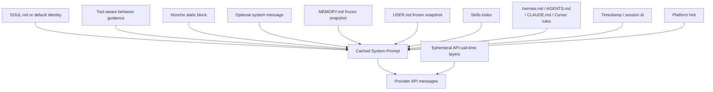

# Prompt Layers

```mermaid
flowchart TB
    Soul[SOUL.md or default identity]
    Guidance[Tool-aware behavior guidance]
    Honcho[Honcho static block]
    Sys[Optional system message]
    Memory[MEMORY.md frozen snapshot]
    User[USER.md frozen snapshot]
    Skills[Skills index]
    Context[.hermes.md / AGENTS.md / CLAUDE.md / Cursor rules]
    Time[Timestamp / session id]
    Platform[Platform hint]
    Cached[Cached System Prompt]
    Ephemeral[Ephemeral API-call-time layers]
    API[Provider API messages]

    Soul --> Cached
    Guidance --> Cached
    Honcho --> Cached
    Sys --> Cached
    Memory --> Cached
    User --> Cached
    Skills --> Cached
    Context --> Cached
    Time --> Cached
    Platform --> Cached
    Cached --> API
    Ephemeral --> API
```

注意：mid-session memory 写入更新磁盘，但通常不改变当前 session 已构建的 cached prompt，除非新 session 或强制 rebuild。
