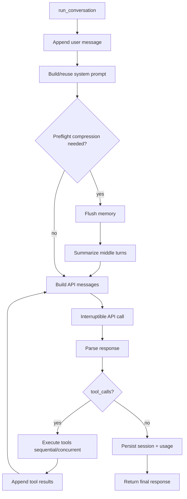

# Agent Turn Lifecycle

```mermaid
flowchart TD
    Start[run_conversation] --> UserMsg[Append user message]
    UserMsg --> Prompt[Build/reuse system prompt]
    Prompt --> Compress{Preflight compression needed?}
    Compress -- yes --> Flush[Flush memory]
    Flush --> Summarize[Summarize middle turns]
    Summarize --> BuildAPI[Build API messages]
    Compress -- no --> BuildAPI
    BuildAPI --> Call[Interruptible API call]
    Call --> Parse[Parse response]
    Parse --> HasTools{tool_calls?}
    HasTools -- yes --> Execute[Execute tools sequential/concurrent]
    Execute --> AppendTool[Append tool results]
    AppendTool --> BuildAPI
    HasTools -- no --> Persist[Persist session + usage]
    Persist --> Return[Return final response]
```

切片阅读 `run_agent.py` 时围绕这张图找代码，不要全文线性阅读。
