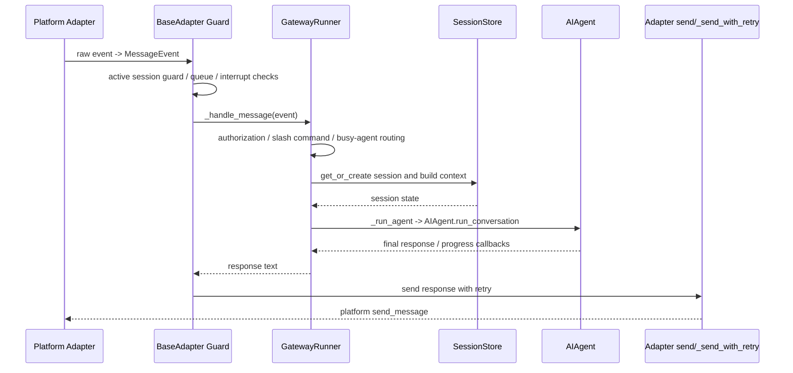

# Gateway Message Flow

A2A 如果走 Gateway adapter 路线，就要复用这套 routing/authorization/session guard；如果走 ACP-like 独立 adapter，就要自己实现 task/session/auth/event bridge。

注意：`gateway/delivery.py` 的 `DeliveryRouter` 不是普通 inbound message 的最终回复路径。普通平台消息由 `BasePlatformAdapter._process_message_background()` 在拿到 `GatewayRunner._handle_message()` 返回值后，通过 adapter 自身的 `_send_with_retry()` / `send()` 发回平台。
