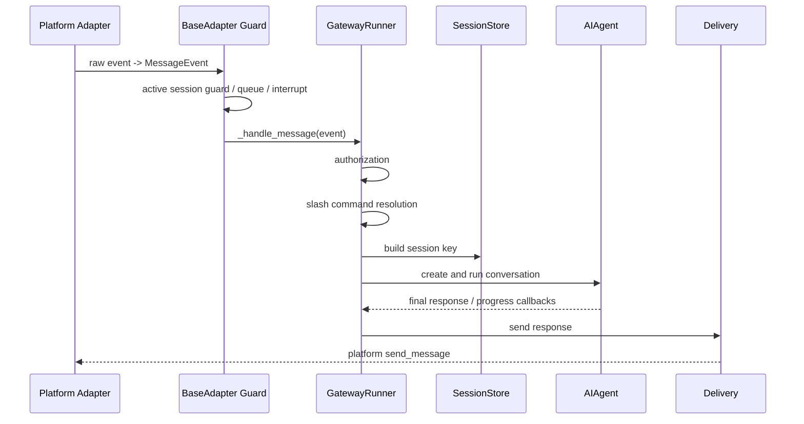

# Gateway Message Flow

```mermaid
sequenceDiagram
    participant Platform as Platform Adapter
    participant Base as BaseAdapter Guard
    participant Runner as GatewayRunner
    participant Session as SessionStore
    participant Agent as AIAgent
    participant Delivery as Delivery

    Platform->>Base: raw event -> MessageEvent
    Base->>Base: active session guard / queue / interrupt
    Base->>Runner: _handle_message(event)
    Runner->>Runner: authorization
    Runner->>Runner: slash command resolution
    Runner->>Session: build session key
    Runner->>Agent: create and run conversation
    Agent-->>Runner: final response / progress callbacks
    Runner->>Delivery: send response
    Delivery-->>Platform: platform send_message
```

A2A 如果走 Gateway adapter 路线，就要复用这套 routing/authorization/delivery；如果走 ACP-like 独立 adapter，就要自己实现 task/session/auth/event bridge。
