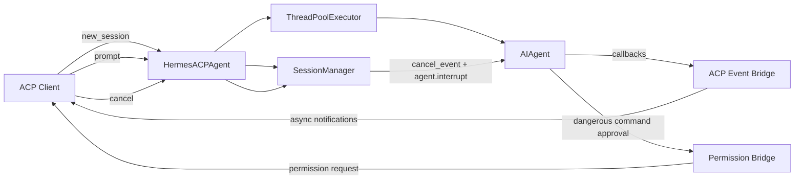

# ACP Bridge Flow

```mermaid
flowchart LR
    Client[ACP Client]
    Server[HermesACPAgent]
    Manager[SessionManager]
    Worker[ThreadPoolExecutor]
    Agent[AIAgent]
    Events[ACP Event Bridge]
    Perm[Permission Bridge]

    Client -->|new_session| Server
    Server --> Manager
    Client -->|prompt| Server
    Server --> Worker
    Worker --> Agent
    Agent -->|callbacks| Events
    Events -->|async notifications| Client
    Agent -->|dangerous command approval| Perm
    Perm -->|permission request| Client
    Client -->|cancel| Server
    Server --> Manager
    Manager -->|cancel_event + agent.interrupt| Agent
```

A2A 的 streaming/cancel/permission bridge 应优先复用这个思路。
