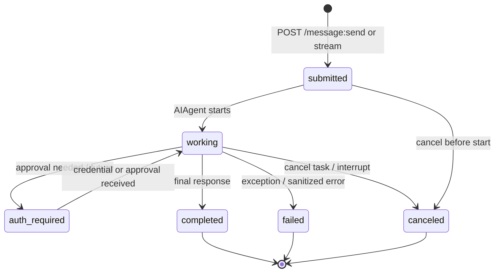
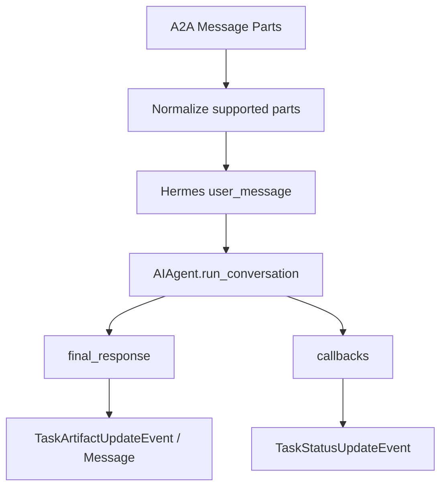

# A2A to Hermes Mapping

```mermaid
stateDiagram-v2
    [*] --> submitted: POST /message:send or stream
    submitted --> working: AIAgent starts
    working --> auth_required: approval needed / future
    auth_required --> working: credential or approval received
    working --> completed: final response
    working --> failed: exception / sanitized error
    working --> canceled: cancel task / interrupt
    submitted --> canceled: cancel before start
    completed --> [*]
    failed --> [*]
    canceled --> [*]
```

```mermaid
flowchart TB
    A2AMsg[A2A Message Parts] --> Normalize[Normalize supported parts]
    Normalize --> UserText[Hermes user_message]
    UserText --> Agent[AIAgent.run_conversation]
    Agent --> Final[final_response]
    Agent --> Progress[callbacks]
    Progress --> Status[TaskStatusUpdateEvent]
    Final --> Artifact[TaskArtifactUpdateEvent / Message]
```
