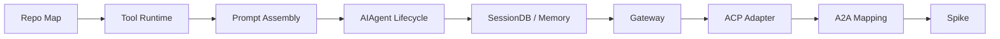
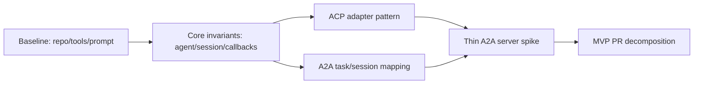

# Learning Plan Review

Date: 2026-05-15

## Goal

评估现有 Hermes 源码学习规划是否合理，并提出更适合 A2A 目标的调整建议。

## Files Read

- `LEARNING_PLAN.md`
- `SOURCE_MAP.md`
- `ROADMAP_A2A.md`
- `checklists/phase-exit.md`
- `checklists/a2a-pr-readiness.md`
- `docs/diagrams/08-a2a-hermes-mapping.md`

## Conclusion

现有规划总体合理：它避免线性精读 `run_agent.py`，先用 Tool System 和 Prompt Assembly 建立可验证闭环，再进入 `AIAgent`、SessionDB、Gateway、ACP，最后映射 A2A。这条路线和 `SOURCE_MAP.md`、`ROADMAP_A2A.md` 的模块边界一致。

主要改进点是节奏：每个 phase 的文档产出偏重，容易在真正验证 A2A 前消耗太久。建议把 Phase 0-2 压缩为 baseline pass，把 Phase 4/6/8 提前交叉验证，尽早做 AgentCard 与 task/session mapping 两个低风险 tracer bullet。

## Current Route

## Suggested Route

## Verification

This session produced a design note instead of code or tests: `notes/design/learning-plan-review.md`.

## Next Step

Read `tools/registry.py`, `model_tools.py`, and `toolsets.py` together for Phase 1, but keep the artifact small: one dispatch diagram, one source note, and one runnable or testable observation.
