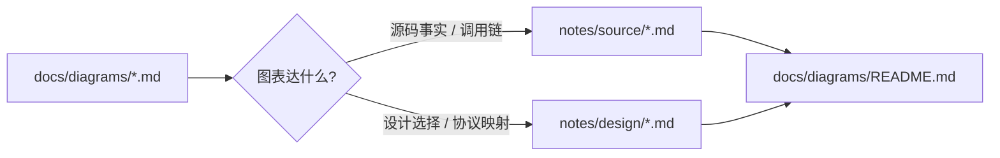

# 2026-05-16 Diagram Organization

本次切片：

- 将 Mermaid 从独立 artifact 分类迁移为 `notes/source/` 和 `notes/design/` 中的表达形式。

阶段来源：

- `LEARNING_PLAN.md` 的学习产出规则。
- 用户明确选择“主题笔记合并”：Mermaid 与 source/design 合并，`docs/diagrams` 只保留索引。

调整内容：

- 更新 `AGENTS.md`、`LEARNING_PLAN.md`、`README.md`、`skills/hermes-source-reading/SKILL.md`，不再要求新建 standalone Mermaid 文件。
- 将系统图、tool dispatch、prompt layers、agent turn lifecycle、Gateway flow、ACP bridge 迁入 `notes/source/`。
- 将 A2A to Hermes mapping 迁入 `notes/design/`。
- 删除旧 standalone diagram 文件，新增 `docs/diagrams/README.md` 作为迁移索引。

调用链：

关键不变量：

- Mermaid 是表达形式，不是知识分类。
- 源码流程图必须靠近具体文件、函数、调用链、不变量和风险。
- 设计/协议图必须靠近设计取舍和安全边界。
- 历史 journal 不重写；通过迁移索引保证旧路径可追踪。

验证动作：

- 用 `rg` 检查活跃指导文档中是否还要求新增 `docs/diagrams/*.md`。
- 用 `rg --files` 检查 `docs/diagrams` 只剩迁移索引，主题图进入 `notes/source` 或 `notes/design`。

产出文件：

- `docs/diagrams/README.md`
- `notes/source/00-architecture-overview.md`
- `notes/source/01-tool-system-overview.md`
- `notes/source/02-prompt-assembly.md`
- `notes/source/03-agent-turn-lifecycle.md`
- `notes/source/05-gateway-internals.md`
- `notes/source/06-acp-adapter.md`
- `notes/design/a2a-hermes-mapping.md`

下一次继续：

- 从 `notes/source/05-gateway-internals.md` 继续补 Gateway context 到 `AIAgent.run_conversation()` 参数映射。
