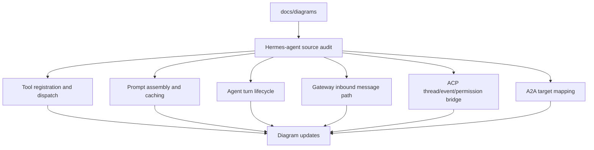

# 2026-05-16 Diagram Source Alignment

本次切片：

- 对 `docs/diagrams/` 做源码对齐审计，并修正明显不符合 Hermes-agent 真实调用链的图。

阶段来源：

- `LEARNING_PLAN.md` 的源码地图/协议入口学习阶段。
- `SOURCE_MAP.md` 的 tools、prompt、gateway、ACP adapter 入口。
- `ROADMAP_A2A.md` 的 A2A 优先级：AgentCard -> task/session mapping -> non-stream -> streaming -> cancellation -> auth/permission -> artifacts。

阅读源码：

- `$HERMES_SRC/model_tools.py`
- `$HERMES_SRC/tools/registry.py`
- `$HERMES_SRC/toolsets.py`
- `$HERMES_SRC/run_agent.py`
- `$HERMES_SRC/agent/prompt_builder.py`
- `$HERMES_SRC/gateway/run.py`
- `$HERMES_SRC/gateway/platforms/base.py`
- `$HERMES_SRC/acp_adapter/server.py`
- `$HERMES_SRC/acp_adapter/session.py`
- `$HERMES_SRC/acp_adapter/events.py`
- `$HERMES_SRC/acp_adapter/permissions.py`

调用链：

关键不变量：

- 普通 registry tool 的定义和 dispatch 中间层是 `model_tools.py`，不是 `AIAgent -> registry` 直连。
- 新内置 tool 仍需要 top-level `registry.register(...)`，并且要能通过 toolset 解析/暴露。
- prompt 中的项目上下文按优先级取第一个匹配来源，不是 `.hermes.md`、`AGENTS.md`、`CLAUDE.md`、Cursor rules 全部叠加。
- Honcho 不是当前 system prompt 的静态层；相关 toolset 已移除。
- Gateway 普通 inbound 回复不走 `DeliveryRouter`，而是 platform adapter 在 background task 里拿到 handler 返回值后 send。
- ACP bridge 已有可借鉴的 `ThreadPoolExecutor`、event callback、permission callback、cancel interrupt 模式。
- A2A 图必须标为目标设计，因为 upstream 目前没有 `a2a_adapter/`。

验证动作：

- 用 `rg` 检查 stale label 是否仍出现在图中。
- 用 `git diff --stat` 检查本次只改文档和学习记录。
- 用 `rg -n` 在 upstream 源码中确认关键函数行号，并记录到 `notes/source/diagram-source-alignment.md`。

发现的偏差：

- `01-tool-dispatch-flow.md` 少了 `model_tools.py` 层。
- `02-prompt-layers.md` 保留了过时 Honcho 静态块，并把项目上下文画成并列叠加。
- `05-gateway-message-flow.md` 把普通回复误画成 `GatewayRunner -> DeliveryRouter -> Platform`。
- `08-a2a-hermes-mapping.md` 未明确说明是未来目标映射。

风险：

- 如果后续按旧 Gateway 图设计 A2A adapter，会误以为只要接 `DeliveryRouter` 就能覆盖普通平台回复。
- 如果按旧 prompt 图暴露上下文，可能误把 prompt/memory/provider 快照当成可远程公开信息，需要继续按安全保守原则处理。

产出文件：

- `docs/diagrams/00-hermes-system-map.md`
- `docs/diagrams/01-tool-dispatch-flow.md`
- `docs/diagrams/02-prompt-layers.md`
- `docs/diagrams/03-agent-turn-lifecycle.md`
- `docs/diagrams/05-gateway-message-flow.md`
- `docs/diagrams/06-acp-bridge-flow.md`
- `docs/diagrams/08-a2a-hermes-mapping.md`
- `notes/source/diagram-source-alignment.md`

下一次继续：

- 从 `$HERMES_SRC/gateway/run.py::_handle_message_with_agent` 和 `_run_agent` 继续，把 Gateway session context 到 `AIAgent.run_conversation()` 的参数映射补成一张更细的 Mermaid 图。
