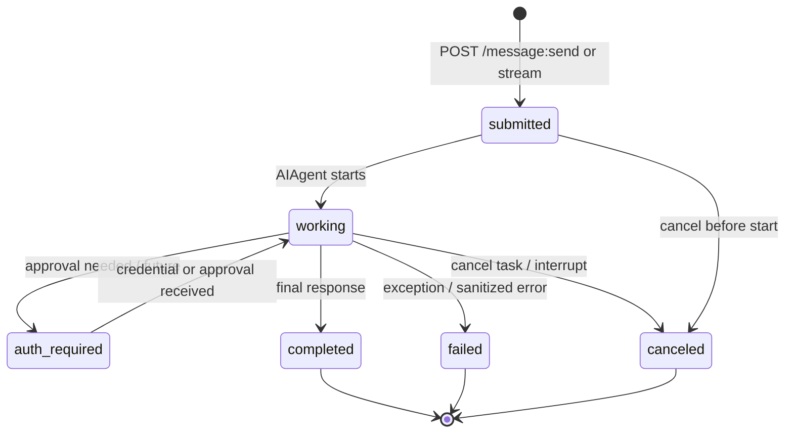
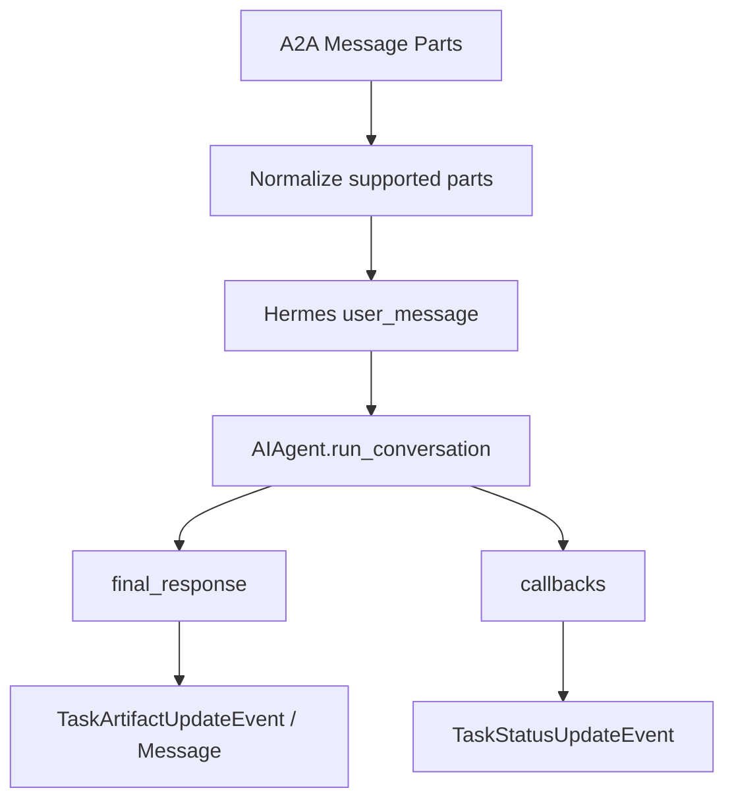

# A2A to Hermes Mapping

这是目标设计，不是当前 upstream Hermes-agent 已存在的真实模块图。目前源码里没有 `a2a_adapter/`；实现前需要先完成 AgentCard、task/session mapping、non-stream message send，再推进 streaming/cancel/auth/artifacts。

设计不变量：

- `taskId` 不等于 Hermes internal session id。
- `contextId` 表达远程 conversation context，内部 session 映射应由 adapter 管理。
- AgentCard 只暴露 capability 摘要，不暴露 prompt、memory、raw reasoning、credentials、完整内部工具表。
- Raw reasoning 和 memory 不进入 streaming event。
- Provider auth 复用 Hermes runtime，不从 A2A request 读取 provider key。

下一步：

- 先设计 AgentCard generator 和 in-memory TaskManager，再接 text-only `message:send`。
