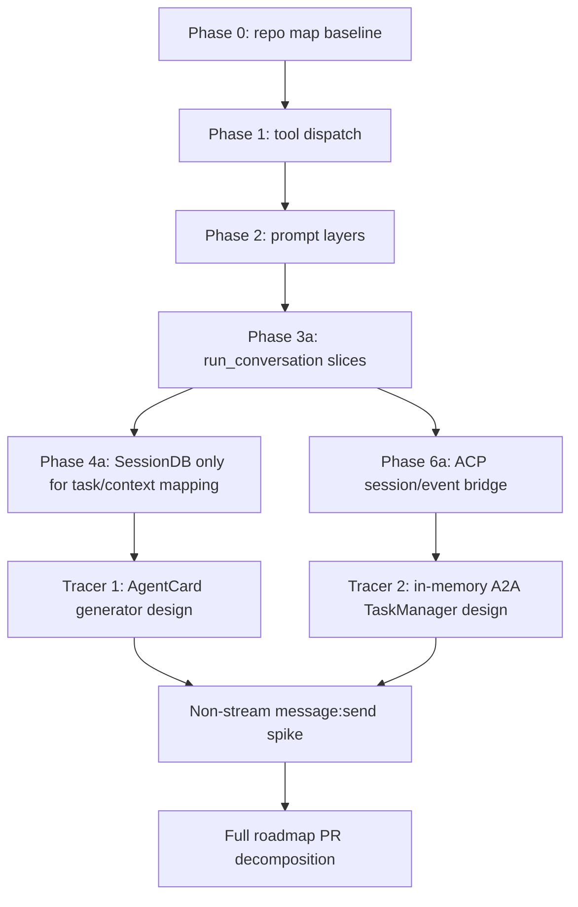
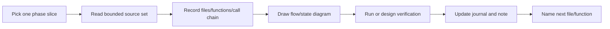
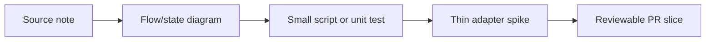

# Learning Plan Review

## Verdict

这个学习规划是合理的，尤其适合“最终要给 Hermes 加 A2A 支持”的目标。它的核心判断正确：

- 不从 `run_agent.py` 线性精读开始；
- 先掌握 Tool System、Prompt Assembly、SessionDB、Gateway、ACP 这些边界清晰的子系统；
- 把 A2A 当成协议适配层，而不是一开始改 `AIAgent` 主循环；
- A2A 优先级采用 `AgentCard -> task/session mapping -> message:send -> streaming -> cancellation -> auth/permission -> artifacts`。

## Relevant Files

- `LEARNING_PLAN.md`: 总学习路线和 phase 验收标准。
- `SOURCE_MAP.md`: 入口层、核心层、Gateway、ACP 的源码定位。
- `ROADMAP_A2A.md`: A2A server MVP、数据模型映射、PR 拆分和安全边界。
- `checklists/phase-exit.md`: 每个 phase 的退出标准。
- `checklists/a2a-pr-readiness.md`: A2A PR 的安全、测试、文档检查项。

## Strengths

1. 路线按依赖排序，降低误读核心循环的风险。
   Tool schema、toolset、prompt、callback、SessionDB 都是理解 `AIAgent.run_conversation()` 的前置条件。

2. A2A 设计边界清楚。
   `ROADMAP_A2A.md` 明确独立 `a2a_adapter/`，复用 AIAgent、provider runtime、SessionDB 和 ACP callback/permission patterns。

3. 安全默认值保守。
   计划反复强调 AgentCard 不暴露 prompt、memory、credentials、raw reasoning 和完整内部工具表，这对远程协议入口是必要约束。

4. PR 拆分可 review。
   AgentCard、TaskManager、non-stream send、stream/cancel、CLI/docs 的拆分顺序符合风险递增。

## Main Risks

1. 文档产出可能过重。
   每个 phase 都要求 source note、diagram、ADR、commit，容易变成写文档多于建立可运行证据。建议每个 phase 只保留一个主 artifact，除非真的发生架构决策。

2. Phase 4、Phase 5、Phase 6 串行时间偏长。
   A2A 真正依赖的是 session/task mapping、ACP event bridge、permission bridge。Gateway internals 有价值，但不一定需要在 ACP 前完整读完。

3. A2A 协议学习放在 Phase 8 稍晚。
   不需要一开始精读整个协议，但 AgentCard、Task、Message、Part、Artifact、CancelTask 应在 Phase 4 前形成最小对象模型，否则读 SessionDB 时缺少目标约束。

4. Spike 太晚。
   等到 Phase 9 才做 spike，反馈周期较长。可以提前做两个不碰 agent loop 的 tracer bullet：AgentCard generator 和 in-memory TaskManager。

5. 当前 `AGENTS.md` 不足以支撑无人值守学习。
   原规则适合有人在场时协作，但没有限定单次切片大小、停止条件、验证动作、交接格式，也没有明确“默认不改上游源码”。如果让 agent 在用户休息时自动推进，容易出现跨 phase 泛读、产物不可复查、或过早实现的风险。

## Suggested Adjustment

## Autonomous Agent Guidance

如果目标是让 agent 在无人值守时按阶段执行学习计划，建议把 `AGENTS.md` 调整为“切片执行协议”，而不是只给通用协作原则。

必需约束：

- 一次只推进一个小切片，不跨多个 phase。
- 单次阅读限制在 3-6 个紧密相关文件。
- 默认不改 Hermes 上游源码；需要改源码时，先输出 PR 拆分和测试计划。
- 每次产出都要能让用户在总结资料基础上继续学习。
- 每次结束必须写明下一次从哪个文件或函数继续。
- 遇到文档和源码不一致时，以源码为准并记录偏差。
- 涉及远程协议入口时，继续保持不暴露 prompt、memory、raw reasoning、credentials、完整内部工具表。

## Recommended Phase Changes

Phase 0-2:
Keep them, but time-box them. The goal is not exhaustive notes; it is to identify stable extension seams:

- `tools/registry.py -> model_tools.py -> toolsets.py`
- `agent/prompt_builder.py -> skills index -> cached prompt`
- context files such as `AGENTS.md` and `.hermes.md`

Phase 3:
Split into narrow slices:

- `AIAgent.__init__`
- `chat()`
- `run_conversation()`
- callback surfaces
- tool call/result pairing
- persistence boundaries

Do not read the whole file linearly.

Phase 4:
Move the A2A mapping question to the front:

- `contextId` is logical conversation context;
- internal Hermes session id stays private;
- `taskId` is one remote operation;
- task state should not be inferred only from message history.

Phase 5:
Treat Gateway as comparison material, not necessarily the implementation base. The key question is whether A2A should reuse `GatewayRunner` or follow ACP as a separate adapter. Current evidence favors ACP-style separate adapter.

Phase 6:
Promote this earlier if the objective is A2A. ACP is the closest source pattern for async protocol service around sync `AIAgent`.

Phase 8-9:
Start with a very small protocol subset before the full spike:

- AgentCard generation;
- in-memory task state transitions;
- text-only `message:send`;
- sanitized error response.

## Key Invariants

- A2A `taskId` must not equal or expose internal Hermes session id.
- AgentCard describes capabilities, not internal tools or private prompts.
- Raw reasoning and memory are never streamed.
- Provider auth is resolved by Hermes runtime, not by A2A request payloads.
- Destructive tools still pass through existing approval policy.
- Streaming events are derived from safe progress/status callbacks, not raw model internals.

## Verification Strategy

Use a phase-level evidence ladder:

每个阶段至少到 `Probe`，不要只停在 `Note`。如果没有代码变更，probe 可以是只读脚本、fixture inspection、或最小测试设计。

## Next Commit

`docs(plan): review learning path and a2a readiness risks`
