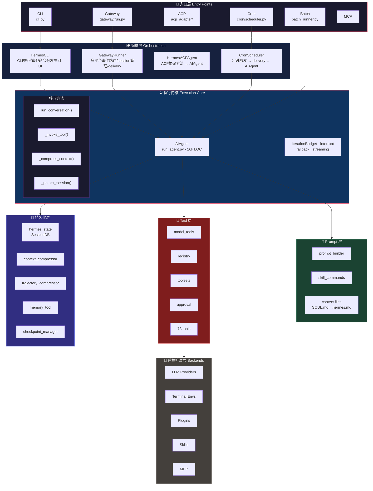
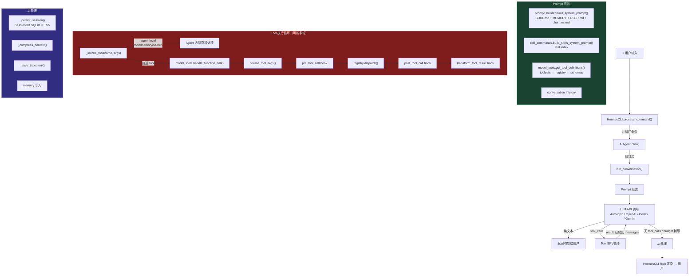

# Hermes 系统架构总览

## 核心结论

> Hermes 不是"一个聊天机器人的 CLI 包装"，而是一个**多入口、多形态、本地优先的 Agent 平台**。
> 它有统一的执行内核（`AIAgent`）、文件化分层 memory、插件式工具注册、20+ 平台适配的 Gateway、以及 ACP 协议适配层。
> 理解 Hermes 的关键是理解"所有入口最终汇合到同一个 `run_conversation()` 循环"。

---

## 一、分层架构图



---

## 二、程序入口（五种运行形态）

Hermes 有五种独立的运行形态，全部最终汇合到 `AIAgent.run_conversation()`：

### 1. CLI 交互形态

```
用户终端 → cli.py (HermesCLI) → AIAgent.run_conversation()
```

- **入口文件**：`cli.py`（13.8k LOC）
- **职责**：Rich banner、prompt_toolkit 输入、斜杠命令、skin 主题、spinner 动画
- **关键类**：`HermesCLI`，`process_command()` 分发斜杠命令
- **特点**：同步阻塞式交互，直接调用 `AIAgent`

### 2. Gateway 多平台形态

```
Telegram/Discord/Feishu/... → gateway/platforms/*.py → MessageEvent
  → gateway/run.py (GatewayRunner) → AIAgent.run_conversation()
  → gateway/delivery.py → 平台 adapter 发回响应
```

- **入口文件**：`gateway/run.py`（~1800 LOC）
- **关键类**：`GatewayRunner`，管理完整生命周期
- **平台适配器**：20+ 个，位于 `gateway/platforms/`
  - `telegram.py`, `discord.py`, `feishu.py`, `slack.py`, `whatsapp.py`
  - `matrix.py`, `signal.py`, `email.py`, `sms.py`, `api_server.py`
  - `webhook.py`, `homeassistant.py`, `wecom.py`, `weixin.py`, ...
- **Session 管理**：`gateway/session.py`（`SessionStore`、`SessionEntry`、`SessionContext`）
- **Delivery**：`gateway/delivery.py`（`DeliveryRouter`、`DeliveryTarget`）
- **特点**：异步多路复用、session key 路由、active-agent guard、hook 系统

### 3. ACP 协议形态（VS Code / JetBrains 集成）

```
IDE (ACP client) → JSON-RPC stdio → acp_adapter/server.py (HermesACPAgent)
  → worker thread 中跑 AIAgent.run_conversation()
  → asyncio.run_coroutine_threadsafe 把 callback 转为 async event
```

- **入口文件**：`acp_adapter/entry.py`（加载 .env、配置 stderr 日志、启动 ACP server）
- **核心类**：`HermesACPAgent(acp.Agent)`（`acp_adapter/server.py`, 1714 LOC）
- **Session 管理**：`acp_adapter/session.py`（`SessionManager`、`SessionState`）
- **Tool 桥接**：`acp_adapter/tools.py`（1180 LOC，MCP resource 转换、tool 池映射）
- **权限桥接**：`acp_adapter/permissions.py`（危险命令审批映射）
- **关键设计**：stdout 只给 JSON-RPC transport，日志走 stderr；AIAgent 在 worker thread 中同步运行，通过 asyncio bridge 转为异步事件

### 4. Cron 定时形态

```
CronScheduler → cron/jobs.py → _run_job_script() or _run_agent_prompt()
  → AIAgent.run_conversation() → _deliver_result() → platform delivery
```

- **入口文件**：`cron/scheduler.py`（1820 LOC）
- **任务执行**：`cron/jobs.py`（1114 LOC）
- **Delivery**：复用 Gateway 的 adapter 发送到目标平台
- **特点**：无人值守运行、prompt injection 防护、delivery target 解析

### 5. Batch 批量形态

```
batch_runner.py → 并行启动多个 AIAgent 实例 → 批量处理任务
```

- **入口文件**：`batch_runner.py`（1302 LOC）
- **特点**：并行执行、每个任务独立 session

---

## 三、一条请求的完整旅程（CLI 路径）



---

## 四、核心模块速查表

### 4.1 执行内核

| 模块 | 关键文件 | LOC | 职责 | 上下游 |
|------|---------|-----|------|---------|
| **AIAgent** | `run_agent.py` | 16,083 | 核心对话循环、tool 调度、压缩、持久化、fallback | 被 CLI/Gateway/ACP/Cron/Batch 调用 |
| **Tool 编排** | `model_tools.py` | 865 | tool discovery、schema 下发、dispatch 编排、hook 链 | 被 AIAgent 调用；调用 registry |
| **Tool 注册** | `tools/registry.py` | ~500 | ToolEntry 数据结构、注册/查询/dispatch、自发现、缓存 | 被 model_tools 调用；被 73 个 tool 文件注册 |
| **Toolset** | `toolsets.py` | 866 | 平台 preset、composite toolset、resolve 展开 | 被 model_tools 调用 |
| **Tool 实现** | `tools/*.py` | 73 个文件 | 每个工具一个文件，top-level `registry.register()` | 被 registry 发现 |

### 4.2 Prompt 与 Context

| 模块 | 关键文件 | LOC | 职责 |
|------|---------|-----|------|
| **Prompt Builder** | `agent/prompt_builder.py` | 1,456 | 组装 system prompt：SOUL.md + MEMORY.md + context files + skills |
| **Skill Commands** | `agent/skill_commands.py` | — | skill index 注入 system prompt |
| **Context Compressor** | `agent/context_compressor.py` | 1,583 | 长对话压缩策略 |

### 4.3 持久化与 Memory

| 模块 | 关键文件 | LOC | 职责 |
|------|---------|-----|------|
| **SessionDB** | `hermes_state.py` | 2,966 | SQLite 存储：sessions、messages、FTS5 全文搜索 |
| **Trajectory Compressor** | `trajectory_compressor.py` | — | 对话轨迹压缩 |
| **Memory Tool** | `tools/memory_tool.py` | — | 用户可控的持久化记忆读写 |

### 4.4 Gateway 层

| 模块 | 关键文件 | 职责 |
|------|---------|------|
| **Gateway Runner** | `gateway/run.py` | 多平台事件路由、session 路由、agent 创建/复用、hook 执行 |
| **Session Store** | `gateway/session.py` | Gateway 级 session 管理（不同于 SessionDB） |
| **Delivery** | `gateway/delivery.py` | 响应发回目标平台的路由 |
| **Platform Adapters** | `gateway/platforms/*.py` | 每个聊天平台的适配器（20+） |

### 4.5 ACP 适配层

| 模块 | 关键文件 | LOC | 职责 |
|------|---------|-----|------|
| **ACP Entry** | `acp_adapter/entry.py` | 148 | CLI 入口，加载 .env，启动 ACP server |
| **ACP Server** | `acp_adapter/server.py` | 1,714 | ACP 协议方法实现、history replay、streaming event |
| **ACP Session** | `acp_adapter/session.py` | 628 | live session、cwd、cancel_event 管理 |
| **ACP Tools** | `acp_adapter/tools.py` | 1,180 | MCP resource 映射、tool 池桥接 |
| **ACP Permissions** | `acp_adapter/permissions.py` | 141 | 危险命令审批桥接 |

### 4.6 Agent 内部模块

| 模块 | 关键文件 | LOC | 职责 |
|------|---------|-----|------|
| **Auxiliary Client** | `agent/auxiliary_client.py` | 4,754 | 辅助模型调用（压缩摘要、review 等） |
| **Anthropic Adapter** | `agent/anthropic_adapter.py` | 2,079 | Anthropic native API 适配 |
| **Codex Responses** | `agent/codex_responses_adapter.py` | 1,050 | Codex Responses API 适配 |
| **Gemini Adapter** | `agent/gemini_native_adapter.py` | 971 | Gemini native API 适配 |
| **Credential Pool** | `agent/credential_pool.py` | 1,603 | 多 API key 轮换 |
| **Error Classifier** | `agent/error_classifier.py` | 1,058 | API 错误分类与 fallback 决策 |
| **Display** | `agent/display.py` | 1,011 | KawaiiSpinner、Rich 输出格式化 |

### 4.7 扩展系统

| 模块 | 位置 | 职责 |
|------|------|------|
| **Skills** | `skills/`, `optional-skills/` | 内置 + 可选 skill，YAML frontmatter + Markdown body |
| **Plugins** | `plugins/` | memory、context_engine、model-providers、kanban、image_gen 等 |
| **MCP** | `tools/mcp_tool.py`, `mcp_serve.py` | MCP tool 发现与注册 |
| **Terminal Envs** | `tools/environments/` | Docker、SSH、Modal、Daytona 等执行环境 |

---

## 五、源码规模概览

| 类别 | 文件数 | LOC | 说明 |
|------|--------|-----|------|
| 执行内核 (`run_agent.py`) | 1 | 16,083 | 单体核心，对话循环 |
| CLI (`cli.py`) | 1 | 13,809 | CLI 交互编排 |
| Agent 内部 (`agent/`) | ~25 | 37,450 | provider adapter、prompt、memory、display |
| 工具 (`tools/`) | 73+ | ~15,000 | 每个工具一个文件 |
| Gateway (`gateway/`) | 53 | ~10,000 | 20+ 平台适配器 + session + delivery |
| ACP 适配器 (`acp_adapter/`) | 9 | 4,035 | 协议适配层 |
| Cron | 3 | 2,976 | 定时调度 |
| 状态 (`hermes_state.py`) | 1 | 2,966 | SessionDB |
| **总计（Python）** | — | **815,448** | 含 tests、plugins、网站等 |

---

## 六、核心不变量

1. **所有入口最终汇合到 `AIAgent.run_conversation()`** — CLI、Gateway、ACP、Cron、Batch 共享同一个执行内核，不存在两套实现的行为差异风险
2. **Tool 注册在模块 top-level** — 73 个 tool 文件在 import 时自动注册，AST 级自发现
3. **Agent-level tools 不走 registry dispatch** — `todo`、`memory`、`session_search`、`delegate_task` 在 `AIAgent._invoke_tool()` 中直接处理
4. **`model_tools.py` 是 AIAgent 和 Tool 系统之间的唯一中介** — schema 下发、dispatch 编排、hook 链都在这里
5. **AIAgent 不直接访问 registry** — 全部通过 `model_tools.py` 中转
6. **check_fn fail-safe** — 探测异常 = tool unavailable，不炸 agent loop
7. **Tool handler 返回值必须是 JSON 字符串** — 异常在 registry.dispatch() 内包装

---

## 七、A2A 在架构中的位置

```mermaid
graph TB
    A2A["🔮 A2A Adapter<br/>a2a_adapter/ — 需要新建"]
    A2A -->|"与 ACP adapter 同级<br/>复用 AIAgent 核心循环"| CORE

    subgraph entries["现有入口"]
        CLI["CLI"]
        GW["Gateway"]
        ACP["ACP"]
        CRON["Cron"]
        BATCH["Batch"]
    end

    subgraph core_layer[""]
        CORE["AIAgent.run_conversation()"]
    end

    style A2A fill:#7f1d1d,stroke:#fca5a5,color:#eee
    style entries fill:#1a1a2e,stroke:#e94560,color:#eee
    style core_layer fill:#0f3460,stroke:#e94560,color:#eee
```

**关键决策**：A2A adapter 不应从修改 `AIAgent` 主循环开始，而是像 ACP 一样作为独立适配层包住同步 AIAgent，暴露 HTTP+JSON 协议服务。

---

## 八、推荐的全局源码阅读路径

> 从整体到局部，按依赖深度渐进。每个阶段先看笔记建立全貌，再按推荐顺序啃源码。

```
Step 0: 架构总览（本文档）
  目标：理解 5 种入口形态、分层架构、核心不变量
  ↓

Step 1: Tool System ← 最容易形成「源码→行为→测试」闭环
  笔记：01-tool-system-full-chain.md
  阅读顺序：tools/registry.py → model_tools.py → toolsets.py → tools/approval.py → tools/terminal_tool.py
  ↓

Step 2: Prompt Assembly ← 理解 system prompt 是怎么组装出来的
  笔记：02-prompt-assembly.md
  阅读顺序：agent/prompt_builder.py → agent/skill_commands.py → tools/memory_tool.py → skills/*/SKILL.md
  ↓

Step 3: AIAgent Turn Lifecycle ← 16k LOC 核心，按调用链切片
  阅读顺序：run_agent.py:__init__ → chat() → run_conversation() → _invoke_tool() → _compress_context() → _persist_session()
  注意：不要线性读，按调用链切片
  ↓

Step 4: SessionDB / Memory / Compression
  阅读顺序：hermes_state.py → agent/context_compressor.py → tools/memory_tool.py
  ↓

Step 5: Gateway
  阅读顺序：gateway/platforms/base.py → gateway/platforms/webhook.py → gateway/run.py → gateway/delivery.py → gateway/session.py
  ↓

Step 6: ACP Adapter（A2A 直接参考对象）
  阅读顺序：acp_adapter/entry.py → acp_adapter/server.py → acp_adapter/session.py → acp_adapter/tools.py → acp_adapter/permissions.py
```

---

## 九、重难点清单

| # | 难点 | 源码位置 | 难度 | 说明 |
|---|------|---------|------|------|
| 1 | AIAgent.run_conversation() 主循环状态机 | `run_agent.py` | ★★★ | 16k LOC 单体，含 streaming/tool loop/compression/fallback/interrupt 交织，非线性逻辑。需要按调用链切片逐个理解，切忌从头读到尾 |
| 2 | Tool 注册的 AST 自发现机制 | `tools/registry.py` | ★★ | import 时触发 top-level `registry.register()`，AST 级参数提取而非运行时反射。理解为什么用 AST 而非 import 是关键 |
| 3 | Prompt 分层组装的优先级体系 | `agent/prompt_builder.py` | ★★ | stable/context/volatile 三层 + context file priority (.hermes.md > AGENTS.md > ...)，叠加 prompt_caching 标记。优先级规则决定最终 LLM 看到什么 |
| 4 | Gateway 多路复用与 Session 路由 | `gateway/run.py` | ★★ | 异步多路事件、session key 路由、active-agent guard、hook 执行。20+ 平台适配器的生命周期管理 |
| 5 | ACP 同步/异步桥接 | `acp_adapter/server.py` | ★★ | AIAgent 在 worker thread 中同步运行，通过 asyncio.run_coroutine_threadsafe 转为异步事件。stdout/stderr 分离。理解这个桥接是理解 ACP 的核心 |
| 6 | Tool 审批链与安全模型 | `tools/approval.py` | ★★ | 1369 行，四级审批（auto/suggest/confirm/deny），动态环境检测（Docker/SSH/Modal），与 platform 的 permission 映射 |
| 7 | Context Compression 策略 | `agent/context_compressor.py` | ★ | 1583 行，多种压缩策略（summary/trim/trajectory），何时触发、如何保留关键信息 |
| 8 | Toolset resolve 递归展开 | `toolsets.py` | ★ | composite toolset 可以嵌套引用，resolve 时递归展开。理解递归终止条件和平台 preset 覆盖 |

---

## 十、设计意图（Why）

**Q: 为什么 `run_agent.py` 是 16k LOC 的单体文件，不拆分？**

AIAgent 是 Hermes 的执行内核，核心方法之间共享大量实例状态（messages、tool registry、session、compression state）。拆成独立类会增加状态传递复杂度，而 Python 的 module 本身就是天然的命名空间。实际阅读时按调用链切片（chat → run_conversation → _invoke_tool），不需要从头到尾线性读。

**Q: 为什么 Tool 注册用 AST 而不是直接 import 调用？**

AST 自发现允许在 import 阶段提取 handler 的参数签名和 docstring，生成精确的 tool schema，无需运行时反射或手写 JSON Schema。代价是注册代码不能有运行时动态逻辑，必须在 top-level 直接调用 `registry.register()`。

**Q: 为什么 `model_tools.py` 是 AIAgent 和 Tool 系统之间的唯一中介？**

解耦。AIAgent 不直接访问 registry，所有 tool discovery、schema 下发、dispatch 编排、hook 链都经过 model_tools。这样 registry 的内部结构变化不会影响 AIAgent，反之亦然。

**Q: 为什么 ACP adapter 用同步 AIAgent + asyncio bridge 而不是全异步？**

AIAgent.run_conversation() 内部使用了阻塞 I/O（SQLite 写入、文件操作、subprocess 调用）。改为全异步意味着重写整个内核。ACP 的做法是在 worker thread 中同步跑 AIAgent，通过 `asyncio.run_coroutine_threadsafe()` 桥接到 asyncio 事件循环。这是最务实的方案——不改内核就能适配异步协议。

**Q: 为什么有 5 种独立的运行形态而不是统一入口？**

不同使用场景的约束差异大：CLI 需要交互式 prompt_toolkit，Gateway 需要异步多路复用，ACP 需要 JSON-RPC stdio，Cron 需要无人值守 + delivery，Batch 需要并行。强行统一入口会增加不必要的抽象层。当前设计是共享内核（AIAgent），各自适配（5 个入口）。

---

## 十一、下一步

- Tool System 全链路详解见 `01-tool-system-full-chain.md`
- Prompt Assembly 详解见 `02-prompt-assembly.md`
- 代码证据索引见 `00-source-file-index.md`
