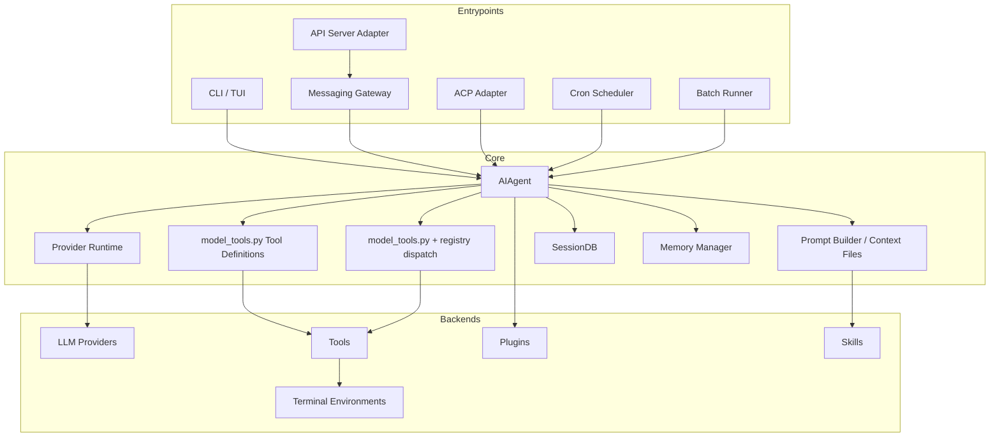

# Hermes Repo Map

目标：用一个顶层系统图定位 Hermes 的入口、共享核心和后端扩展面。详细模块表继续以 `SOURCE_MAP.md` 为准。

关键不变量：

- A2A 不应从修改 `AIAgent` 主循环开始；优先作为协议适配层复用核心。
- API Server 是 Gateway adapter 路径的一部分，不是直接绕过 Gateway 的独立核心入口。
- Tool schema 和 dispatch 的共享中介是 `model_tools.py`，registry 只负责注册、过滤查询和 handler dispatch。

下一次继续：

- Phase 1 从 `tools/registry.py`、`model_tools.py`、`toolsets.py` 的 tool dispatch 链路继续。
