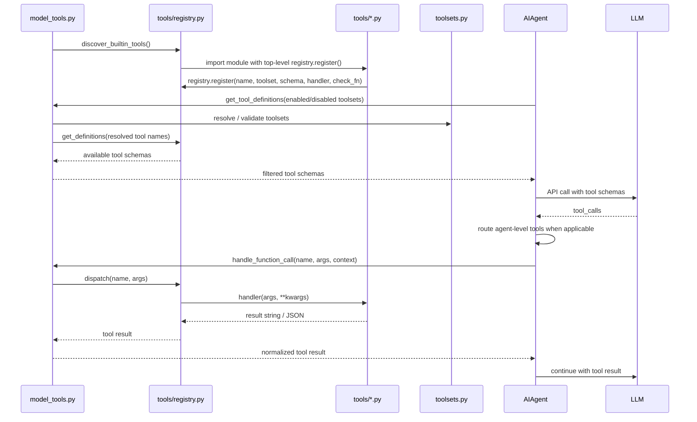

# Tool Runtime

## 核心结论

> Hermes 的 Tool 系统是一条清晰的扩展链：tool 文件自注册 → registry → toolset 展开 → schema 下发给 LLM → tool call → dispatch → handler → result。
> 中间层是 `model_tools.py`，它是 AIAgent 和 Tool 系统之间的唯一中介。
> Agent-level tools（todo/memory/session_search/delegate_task）不走 registry，直接在 AIAgent 内部处理。

> **在架构中的角色**：Tool 系统是 Hermes 最容易形成"源码→行为→测试"闭环的模块，也是理解 Agent Loop 的前置知识。所有入口（CLI/Gateway/ACP/Cron）最终都通过同一个 `handle_function_call()` 路径执行工具。

---

## 推荐阅读路径

```
1. tools/registry.py (先看 ToolEntry 数据结构和 discover_builtin_tools)
   → 快速理解注册机制，15 分钟可建立心智模型
2. model_tools.py (重点看 get_tool_definitions 和 handle_function_call)
   → 理解编排层如何连接 AIAgent 和 registry
3. toolsets.py (看 TOOLSETS 字典和 resolve_toolset)
   → 理解平台 preset 和 composite toolset
4. tools/approval.py + tools/terminal_tool.py
   → 理解安全边界，这是 Phase 1 切片 1-2 的内容
```

## 重难点清单

| # | 难点 | 源码位置 | 难度 | 说明 |
|---|------|---------|------|------|
| 1 | AST 级自发现 | `registry.py:42-54` | ★★ | 为什么用 AST 不用 import？避免 import 副作用 |
| 2 | 三重缓存 key | `model_tools.py:271-332` | ★★ | toolsets frozenset + registry._generation + config_mtime |
| 3 | Agent-level tools 分流 | `run_agent.py:10651` | ★★ | 为什么不在 registry 处理？因为需要 agent 状态 |
| 4 | dynamic_schema_overrides | `registry.py` ToolEntry | ★★ | 运行时 schema 修正（delegate_task 等需要反映当前配置） |
| 5 | check_fn 缓存策略 | `registry.py:126-141` | ★ | 30 秒 TTL + fail-safe，设计意图是平衡性能和安全 |
| 6 | toolset resolve 递归 | `toolsets.py` resolve_toolset | ★★ | 环检测、includes 展开、"all" 特殊别名 |

---

相关源码：

- `tools/registry.py`
- `model_tools.py`
- `toolsets.py`
- `tools/approval.py`
- `tools/terminal_tool.py`



关键不变量：

- 新 tool 的 `registry.register()` 必须在模块 top-level。
- 只注册不够，还要能被 toolset 解析/暴露；内置 tool 通常归属一个 `Toolset`，插件也可以注册 toolset。
- `AIAgent` 不直接向 registry 要 tool schema，也不直接对普通 registry tool 做 dispatch；中间层是 `model_tools.py`。
- `todo`、`memory`、`session_search`、`delegate_task` 等 agent-level tool 会在 `run_agent.py` 内部先被截获处理。
- `check_fn` 出错视为 unavailable。
- tool handler 应返回字符串，通常是 JSON 字符串。
- 异常必须包装成模型可读的 JSON error，而不是炸出 agent loop。

验证方式：

- 用一个简单 tool 追踪 schema 是否进入 `get_tool_definitions()`，再追踪 `handle_function_call()` 是否走到 registry dispatch。
