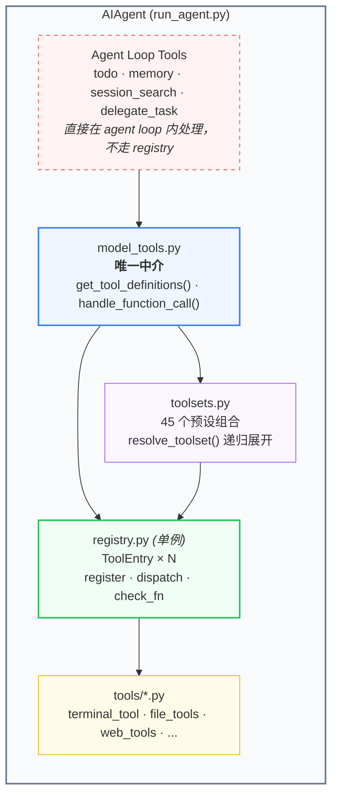
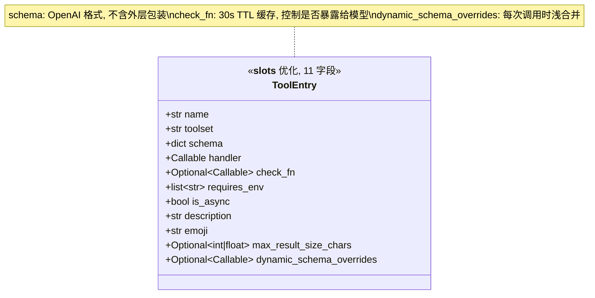
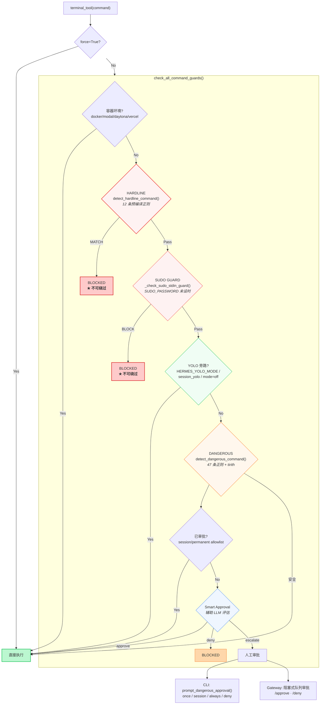
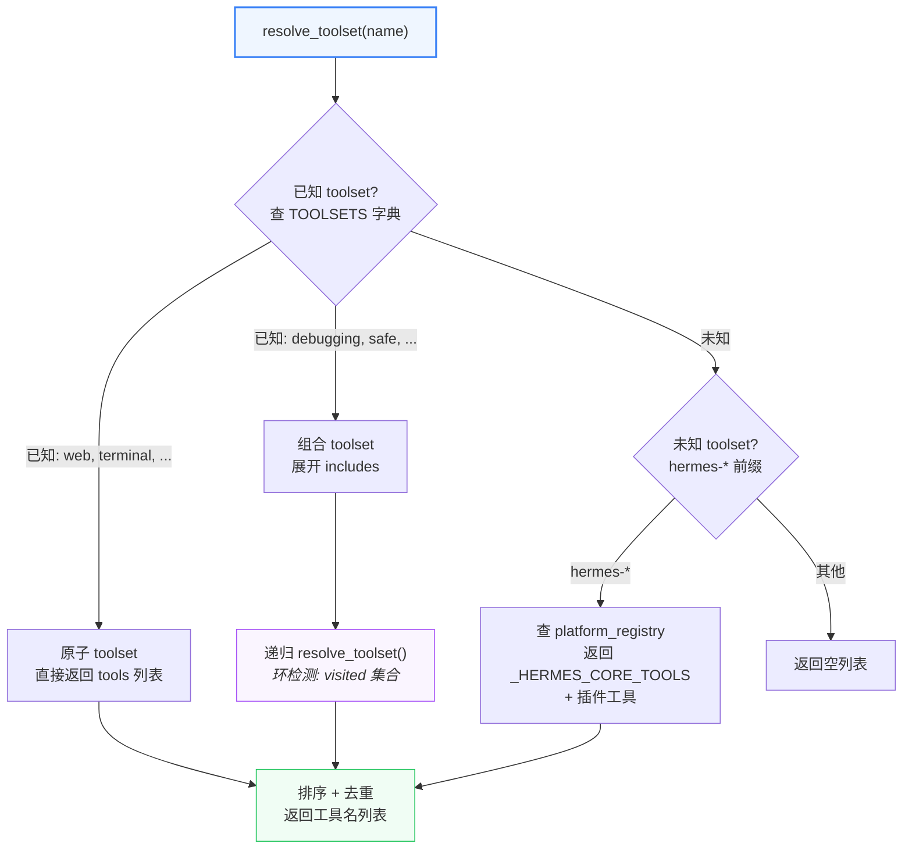

# Tool System：从注册到执行的安全管控全链路

## 核心结论

Hermes 的 Tool 系统是一条清晰的扩展链：**模块级自注册 → Registry 单例 → toolset 展开 → check_fn 可用性过滤 → schema 下发给 LLM → tool call → 审批链 → dispatch → handler → result**。中间层是 `model_tools.py`，它是 AIAgent 和 Tool 系统之间的唯一中介。

安全审批是**四级防护**：hardline（不可绕过，12 个模式）> sudo guard（不可绕过）> dangerous（47 个模式，可审批放行）> yolo（全局旁路）。容器环境直接跳过整个审批层。所有检测前做 **ANSI/null/Unicode NFKC 三步归一化**防混淆绕过。

`check_fn` 控制工具**是否暴露给模型**（30s TTL 缓存），不是 dispatch 时的安全门——实际安全防护在 handler 内部（terminal_tool → `_check_all_guards`）。

## 推荐阅读路径

1. **`tools/registry.py`** — 先看 `ToolEntry`（L77-106）和 `register()`（L234），建立数据结构和注册机制的心智模型
2. **`tools/registry.py`** — 再看 `discover_builtin_tools()`（L57），理解 AST 预扫描的自发现设计
3. **`model_tools.py`** — 看 `get_tool_definitions()`（L271）和 `_compute_tool_definitions()`（L335），理解 schema 如何从 registry 流向 API
4. **`model_tools.py`** — 看 `handle_function_call()`（L697），理解 8 步分发流水线
5. **`toolsets.py`** — 看 `TOOLSETS` 字典和 `resolve_toolset()`，理解 45 个预设如何展开
6. **`tools/approval.py`** — 看 `check_all_command_guards()`（L1020），这是审批链主入口
7. **`tools/terminal_tool.py`** — 看 `check_terminal_requirements()`（L2147），理解 check_fn 如何探测环境

## 重难点清单

| # | 难点 | 源码位置 | 难度 | 说明 |
|---|------|---------|------|------|
| 1 | handle_function_call 8步流水线 | `model_tools.py:697` | ★★★ | 参数矫治→agent loop 拦截→pre hook→dispatch→post hook→transform，是整个 tool system 的中枢 |
| 2 | _compute_tool_definitions 多层解析 | `model_tools.py:335` | ★★★ | toolset 递归展开 + check_fn 过滤 + 3种 schema 后处理 + 缓存策略 |
| 3 | check_all_command_guards 四级防护 | `approval.py:1020` | ★★★ | 合并 tirith 和 dangerous 两个独立检查系统，4种上下文(CLI/Gateway/ASK/Cron)不同路径 |
| 4 | AST 预扫描自发现 | `registry.py:57` | ★★ | 为什么用 AST 不用 import？避免 import 副作用，只检查顶层语句 |
| 5 | _run_async 三路径桥接 | `model_tools.py` | ★★ | 主线程持久loop/工作线程本地loop/async上下文新线程，解决 asyncio.run() 的 GC 问题 |
| 6 | resolve_toolset 递归展开 | `toolsets.py` | ★★ | 环检测 + 菱形依赖 + 插件平台自动生成 |
| 7 | 命令归一化防混淆 | `approval.py:429` | ★★ | ANSI剥离→null字节→NFKC归一化，三步防线 |
| 8 | Gateway 阻塞式审批 | `approval.py:480+` | ★★ | threading.Event 阻塞 + 1s poll + activity heartbeat 防 watchdog |
| 9 | Smart Approval (LLM评估) | `approval.py:843` | ★★ | 辅助 LLM 审批，approve/deny/escalate 三级，引入非确定性但减少中断 |
| 10 | MCP 同名覆盖策略 | `registry.py:250` | ★ | MCP→MCP 允许覆盖（server 刷新），其他 REJECTED |

## 设计意图（Why）

### 为什么用 AST 预扫描而不是直接 import？

`discover_builtin_tools()` 先用 AST 分析源码判断"这个文件是不是工具模块"，再 import。原因：避免 import 副作用——某些辅助模块可能有 heavy 的 import 依赖（如 playwright、Docker SDK）。只检查模块顶层语句，函数体内的 `register()` 调用不算（防止误判）。

### 为什么 MCP 允许同名覆盖，其他不行？

MCP 服务器刷新时需要 nuke-and-repave（先 deregister 旧工具再 register 新工具），同名覆盖是合法操作。而非 MCP 覆盖内置工具则严格禁止——防止插件恶意替换 `terminal` 等核心工具。

### 为什么 async 桥接用持久化 loop 而不是 asyncio.run()？

`asyncio.run()` 每次创建并销毁 event loop，导致缓存的 httpx/AsyncOpenAI 客户端在 GC 时尝试关闭已死 loop → "Event loop is closed" 错误。持久化 loop 让缓存客户端在整个进程生命周期内保持有效。

### 为什么 HARDLINE 只有 12 个模式而 DANGEROUS 有 47 个？

HARDLINE 覆盖的是**不可恢复的灾难性操作**（rm -rf /、mkfs、dd 到裸设备、shutdown、fork bomb）。YOLO 用户信任 agent 操作文件但不信任擦除磁盘/关机——这是设计哲学的核心区分。

---

## 一、模块在架构中的角色



**关键边界**：
- `model_tools.py` 是 AIAgent 和 Tool 系统之间的**唯一中介**
- Agent-level tools（todo/memory/session_search/delegate_task）**不走 registry**，直接在 AIAgent loop 内处理
- 所有入口（CLI/Gateway/ACP/Cron）最终都通过同一个 `handle_function_call()` 路径

## 二、ToolEntry 数据结构



**关键设计**：
- `schema` 形如 `{"name":"terminal", "parameters":{...}}`，不含外层 `{"type":"function","function":...}` 包装
- `check_fn` 返回 bool，结果被 **30s TTL 缓存**（`_check_fn_cached`），避免反复探测外部状态
- `dynamic_schema_overrides` 每次 `get_definitions()` 调用时执行，浅合并到 base schema

## 三、从注册到执行的数据流

```mermaid
graph TD
    subgraph PHASE1["Phase 1: 启动时注册"]
        direction TB
        TOOL["tools/terminal_tool.py<br/><i>模块级代码</i>"]
        DISC["discover_builtin_tools()<br/><i>model_tools.py L180</i><br/>1. AST 扫描 tools/*.py<br/>2. importlib.import_module()<br/>3. 触发各模块 register()"]
        PLUG["discover_plugins()<br/><i>model_tools.py L198</i><br/>插件也调用 register()"]
        REG1["ToolRegistry._tools<br/>= ToolEntry × N<br/>_generation += 1"]

        TOOL -->|"register(name, toolset,<br/>schema, handler, check_fn)"| REG1
        DISC -->|"触发"| TOOL
        PLUG --> REG1
    end

    subgraph PHASE2["Phase 2: Schema 生成"]
        direction TB
        INIT["AIAgent.__init__()<br/>gateway runner"]
        GTF["get_tool_definitions()<br/>enabled_toolsets, disabled_toolsets"]
        COMP["_compute_tool_definitions()"]
        RES["resolve_toolset()<br/>递归展开 TOOLSETS"]
        CHK["check_fn 过滤<br/><i>30s TTL 缓存</i>"]
        POST["后处理<br/>execute_code / discord schema 重建"]
        API["LLM API call<br/>tools=tool_definitions"]

        INIT --> GTF --> COMP
        COMP --> RES --> CHK --> POST --> API
    end

    subgraph PHASE3["Phase 3: 工具调用分发"]
        direction TB
        LLM["LLM 返回 tool_calls"]
        COERCE["Step 1: coerce_tool_args()<br/><i>\"42\"→42, \"true\"→True</i>"]
        INTER["Step 2: Agent Loop 拦截<br/>todo/memory/... → stub"]
        PRE["Step 3: pre_tool_call 钩子<br/>可阻断执行"]
        DISP["Step 5: registry.dispatch()"]
        HANDLER["handler(args)<br/>→ handle_terminal()"]
        APPROV["_check_all_guards()<br/><i>审批链</i>"]
        POSTH["Step 6-7: post/transform 钩子"]
        RESULT["messages.append<br/>{role: tool, content: result}"]

        LLM --> COERCE --> INTER --> PRE --> DISP --> HANDLER --> APPROV
        APPROV --> POSTH --> RESULT
    end

    PHASE1 -->|"注册完成"| PHASE2
    PHASE2 -->|"schema 下发"| PHASE3

    style PHASE1 fill:#f0fdf4,stroke:#22c55e,stroke-width:2px
    style PHASE2 fill:#eff6ff,stroke:#3b82f6,stroke-width:2px
    style PHASE3 fill:#fefce8,stroke:#eab308,stroke-width:2px
    style DISP fill:#fef2f2,stroke:#ef4444,stroke-width:2px
    style APPROV fill:#fef2f2,stroke:#ef4444,stroke-width:1px
```

## 四、安全审批链

### 4.1 四级防护结构



### 4.2 归一化防混淆（三步防线）

所有检测函数在匹配前先执行 `_normalize_command_for_detection()`：

1. **ANSI 剥离**：`strip_ansi()` → 移除 ESC 序列（防止 `r\x1b[0mm -rf /`）
2. **Null 字节剥离**：`command.replace('\x00', '')`（防止 `r\x00m -rf /`）
3. **Unicode NFKC 归一化**：`unicodedata.normalize('NFKC', ...)`（防止 `ｒｍ` 全角绕过）

归一化后再 `.lower()` 传入正则匹配，实现大小写无关检测。

### 4.3 check_fn vs 审批链的区别

| 维度 | check_fn | 审批链 (approval) |
|------|----------|-------------------|
| 目的 | 控制工具**是否暴露**给模型 | 控制命令**是否执行** |
| 调用时机 | `get_definitions()` 生成 schema 时 | `dispatch()` → handler 内部 |
| 缓存 | 30s TTL | 无缓存（每次检测） |
| 作用范围 | 模型看不到不可用工具 | 用户可审批放行 |
| 典型例子 | Docker daemon 是否运行 | `rm -rf` 是否危险 |

## 五、Toolset 系统

### 5.1 预设组合（45 个）

```
原子 toolset (单类别):
  web, search, vision, video, image_gen, computer_use,
  terminal, moa, skills, browser, cronjob, messaging,
  rl, file, tts, todo, memory, session_search, clarify,
  code_execution, delegation, homeassistant, kanban,
  discord, discord_admin, feishu_doc, feishu_drive, spotify

组合 toolset:
  debugging = terminal + web + file
  safe = web + vision + image_gen  (无 terminal)
  hermes-gateway = 所有 hermes-* 消息平台

平台 toolset (hermes-* 前缀):
  hermes-cli       → _HERMES_CORE_TOOLS (37 个)
  hermes-acp       → 核心工具 - 部分 (无 clarify/tts/computer_use 等)
  hermes-telegram  → 核心工具
  hermes-discord   → 核心工具 + [discord, discord_admin]
  hermes-feishu    → 核心工具 + [feishu_doc_read, feishu_drive_*]
  ... 更多平台
```

### 5.2 resolve_toolset() 递归展开



## 六、async 桥接的三路径策略

```mermaid
graph TD
    CALL["_run_async(coro)"]
    CHECK{"当前执行上下文?"}
    ASYNC["路径 1: async 上下文<br/><i>gateway / RL env</i>"]
    WORKER["路径 2: 工作线程<br/><i>delegate_task 并行执行</i>"]
    MAIN["路径 3: 主线程<br/><i>CLI 常规路径</i>"]

    NEW["新线程 + 专用 event loop<br/>ThreadPoolExecutor(1)<br/>300s 超时"]
    WLOOP["线程本地持久化 loop<br/>_get_worker_loop()"]
    MLOOP["全局持久化 loop<br/>_get_tool_loop()"]

    WHY["为什么不直接 asyncio.run()?<br/>asyncio.run() 每次创建+销毁 loop<br/>→ 缓存的 httpx/AsyncOpenAI 客户端<br/>  在 GC 时关闭已死 loop<br/>→ \"Event loop is closed\" 错误<br/>→ 持久化 loop 避免此问题"]

    CALL --> CHECK
    CHECK -->|"async 上下文"| ASYNC --> NEW
    CHECK -->|"工作线程"| WORKER --> WLOOP
    CHECK -->|"主线程"| MAIN --> MLOOP

    style CALL fill:#eff6ff,stroke:#3b82f6,stroke-width:2px
    style WHY fill:#fefce8,stroke:#eab308,stroke-width:1px,stroke-dasharray: 5 5
    style ASYNC fill:#fef2f2,stroke:#ef4444,stroke-width:1px
    style WORKER fill:#faf5ff,stroke:#a855f7,stroke-width:1px
    style MAIN fill:#f0fdf4,stroke:#22c55e,stroke-width:1px
```

## 七、关键源码文件

| 文件 | 行数 | 职责 |
|------|------|------|
| `tools/registry.py` | 563 | ToolEntry 数据结构、register/deregister、dispatch、check_fn TTL 缓存 |
| `model_tools.py` | 865 | schema 生成、8步分发流水线、coerce_tool_args、_run_async |
| `toolsets.py` | 866 | 45 个预设组合、resolve_toolset 递归展开 |
| `tools/approval.py` | 1369 | 四级安全审批、归一化防混淆、Gateway 阻塞式审批 |
| `tools/terminal_tool.py` | 2373 | terminal handler、check_terminal_requirements、环境管理 |

---

本次回答了：Tool System 从注册到执行的完整生命周期、四级安全审批链的设计哲学、check_fn vs 审批链的区别。

下一次应从 `agent/prompt_builder.py` 继续，回答"Hermes 如何将 SOUL.md / MEMORY / skills 组装成 LLM 的 system prompt"。
