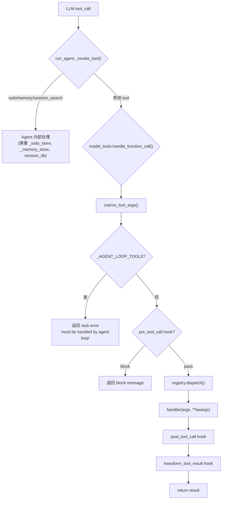

# Tool Registry & Dispatch 深度切片

> Phase 1 / 切片 1-1
> 回答的问题：ToolEntry 数据结构和 registry 的注册/查询/dispatch 内部机制是什么？

## 核心数据结构

### ToolEntry (`tools/registry.py:77-106`)

`__slots__` 优化，11 个字段：

| 字段 | 类型 | 说明 |
|---|---|---|
| `name` | str | 全局唯一 tool 标识 |
| `toolset` | str | 所属 toolset 名 |
| `schema` | dict | OpenAI function schema（含 parameters） |
| `handler` | Callable | 实际执行函数 |
| `check_fn` | Callable? | 可用性检查，返回 bool |
| `requires_env` | list | 环境变量依赖（展示用） |
| `is_async` | bool | 是否异步 handler |
| `description` | str | 工具描述 |
| `emoji` | str | UI 图标 |
| `max_result_size_chars` | int? | 单工具结果大小限制 |
| `dynamic_schema_overrides` | Callable? | 运行时 schema 覆盖（如 delegate_task 需反映当前配置） |

### ToolRegistry (`tools/registry.py:151-514`)

模块级单例 `registry = ToolRegistry()`。

内部状态：
- `_tools: Dict[str, ToolEntry]` — name → entry
- `_toolset_checks: Dict[str, Callable]` — toolset → check_fn
- `_toolset_aliases: Dict[str, str]` — alias → canonical toolset
- `_lock: threading.RLock` — 保护并发读写（MCP 动态刷新场景）
- `_generation: int` — 单调递增版本号，每次 mutation +1，用于缓存失效

## 自发现机制

`discover_builtin_tools()` (`registry.py:57-74`)：

1. 扫描 `tools/` 目录下所有 `.py` 文件（排除 `__init__.py`, `registry.py`, `mcp_tool.py`）
2. **AST 级检测**：`_module_registers_tools()` 解析每个文件，只看 module-body 级的 `registry.register(...)` 调用（不检测函数体内的调用）
3. 对通过检测的模块执行 `importlib.import_module()`，触发模块顶层代码，执行 `registry.register()`

为什么用 AST 而非 import？避免 import 副作用（依赖缺失、环境检查等）污染发现过程。

## 注册过程 (`register()` @ L234-288)

```
register(name, toolset, schema, handler, check_fn=None, ...)
```

关键逻辑：
1. **同名冲突检测**：已存在同 name 但不同 toolset 的 entry 时
   - MCP→MCP 覆盖：允许（server 刷新场景）
   - 其他情况：**REJECTED**，log error 并 return（防止插件覆盖内置工具）
2. 首次注册某个 toolset 的 check_fn 时，记录到 `_toolset_checks`
3. `_generation += 1` 触发下游缓存失效

**`deregister()`** (`L290-314`)：MCP 动态工具发现场景。删除 entry，如果 toolset 下已无其他 tool，连带清除 `_toolset_checks` 和相关 aliases。

## check_fn 缓存 (`_check_fn_cached` @ L126-141)

- TTL = 30 秒
- 异常吞为 False（fail-safe）
- 线程安全（`_check_fn_cache_lock`）
- `invalidate_check_fn_cache()` 显式清除（配置变更后调用）

为什么需要？`check_terminal_requirements` 这类函数探测外部状态（Docker daemon、Modal SDK、playwright），长生命周期进程中每次调用都探测是浪费。

## Schema 下发 (`get_definitions()` @ L320-367)

```
get_definitions(tool_names: Set[str]) → List[dict]
```

1. Snapshot 所有 entries（lock 保护下复制）
2. 对每个请求的 name：
   - 查找 entry，无则 skip
   - `check_fn` 通过（或无 check_fn）才继续
   - 合并 `dynamic_schema_overrides`（每次调用都执行 callable）
   - 包装为 `{"type": "function", "function": schema}` 返回

**per-call cache**：同一 pass 中重复 check_fn 只执行一次（`check_results` dict）。

## Dispatch (`dispatch()` @ L373-390)

```
dispatch(name, args, **kwargs) → str
```

1. `get_entry(name)` → 无则返回 `{"error": "Unknown tool"}`
2. `is_async` → 桥接到 `_run_async()`（从 `model_tools` import）
3. `handler(args, **kwargs)` → 异常捕获包装为 `{"error": "..."}`
4. **返回值始终是 JSON 字符串**

## model_tools.py 编排层

### `get_tool_definitions()` (`L271-332`)

完整缓存链：
```
cache_key = (frozenset(enabled_toolsets), frozenset(disabled_toolsets), registry._generation, config_mtime)
```

缓存命中条件：toolsets 不变 + registry 无 mutation + config 未编辑。

未命中 → `_compute_tool_definitions()`：
1. enabled_toolsets → `resolve_toolset()` → tool names
2. disabled_toolsets → 从上述集合减去
3. `registry.get_definitions(tools_to_include)` → check_fn 过滤后的 schemas
4. **动态 schema 修正**：
   - `execute_code` 的 sandbox_allowed_tools 只列实际可用的工具
   - `discord`/`discord_admin` 根据 bot intents 修正 schema
   - `browser_navigate` description 中移除不可用的 web 工具引用
5. `sanitize_tool_schemas()` 修正 llama.cpp 不兼容的 schema 形状

### `handle_function_call()` (`L697-836`)

完整 dispatch 路径：

```
handle_function_call(name, args)
  → coerce_tool_args(name, args)      # 类型强转："42"→42, "true"→True
  → _AGENT_LOOP_TOOLS 检查            # todo/memory/session_search/delegate_task → 返回 stub error
  → pre_tool_call hook 检查           # 插件可拦截
  → registry.dispatch(name, args)     # 实际执行
  → post_tool_call hook               # 观测性回调
  → transform_tool_result hook        # 结果变换
  → return result
```

**Agent-level tools** (`run_agent.py:10673-10719`)：`todo`, `memory`, `session_search` 在 `AIAgent._invoke_tool()` 中直接处理，需要 agent 级状态（`_todo_store`, `_memory_store`, `session_db`）。`delegate_task` 同理。



## Toolsets (`toolsets.py`)

静态 `TOOLSETS` 字典 + 动态 registry 查询混合系统。

核心概念：
- **`_HERMES_CORE_TOOLS`**：所有平台共享的工具列表（CLI、Telegram、Discord 等都基于此）
- **平台 toolset**：`hermes-cli`, `hermes-telegram`, `hermes-discord` 等，大部分 = `_HERMES_CORE_TOOLS`，个别有额外工具
- **composite toolset**：`hermes-gateway` includes 所有平台 toolset；`debugging` includes `web` + `file`
- **`resolve_toolset()`**：递归展开 includes，检测环，支持 `"all"` / `"*"` 特殊别名
- **插件 toolset**：registry 中有但 `TOOLSETS` 字典中没有的 → 自动识别为 plugin toolset
- **`hermes-<name>` 自动生成**：未知 `hermes-` 前缀 toolset 会查 `platform_registry`，如已注册则自动给 `_HERMES_CORE_TOOLS` + 插件工具

## 关键不变量

1. **Tool handler 返回值必须是 JSON 字符串** — 所有异常在 registry.dispatch() 内包装
2. **check_fn fail-safe** — 异常 = unavailable，不炸 agent loop
3. **注册幂等保护** — 非 MCP 同名覆盖会被 REJECTED
4. **Agent-level tools 不走 registry dispatch** — `_invoke_tool()` 直接调用，需要 agent 状态
5. **Schema 一致性** — `get_definitions()` 返回的 schema 中引用的工具名必须实际可用（动态修正确保）
6. **缓存一致性** — `registry._generation` + config mtime + toolsets frozenset 三重 key

## A2A 启示

- A2A adapter 中暴露的 tools 应该走 registry 的一套机制（schema、check_fn、dispatch），不需要另起炉灶
- `dynamic_schema_overrides` 模式可用于 A2A AgentCard 的运行时属性注入
- `_generation` 版本号机制可用于 A2A 的 agent discovery 缓存失效
- MCP toolset 的注册/注销生命周期（`register` / `deregister` + `notifications/tools/list_changed`）与 A2A 的 task lifetime 有对应关系

## 验证动作

- [x] 确认 `discover_builtin_tools()` 使用 AST 扫描（`_module_registers_tools` 源码 L42-54）
- [x] 确认 `register()` 同名冲突检测逻辑（L250-272，MCP→MCP 允许，其他 REJECTED）
- [x] 确认 agent-level tools 在 `run_agent._invoke_tool()` 中直接处理（L10673-10719）
- [x] 确认 `handle_function_call` 中 `_AGENT_LOOP_TOOLS` 返回 stub error（L727-728）
- [x] 确认 72 个 tool .py 文件在 tools/ 目录

## 下一次继续

从 `tools/approval.py` + `tools/terminal_tool.py` 的安全审批链开始，回答：危险命令如何被拦截和审批？`check_fn` 在 terminal 场景具体探测什么？
