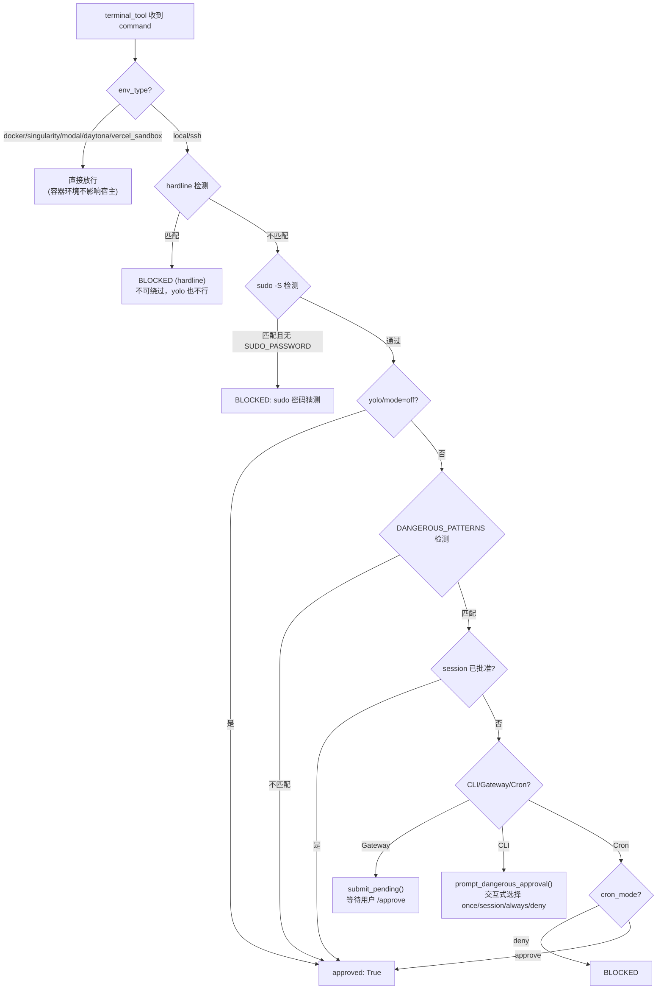

# 安全审批链 & Tool 端到端追踪

> Phase 1 / 切片 1-2
> 回答的问题：危险命令审批链如何工作？check_fn 在 terminal 场景探测什么？一个 tool 从注册到执行的完整路径？

## 危险命令审批系统 (`tools/approval.py`, 1369 行)

### 三层防护



### Hardline（无条件阻止）

12 个 pattern（`HARDLINE_PATTERNS`），覆盖：
- `rm -rf /`、`rm -rf /home`、`rm -rf ~`
- `mkfs`、`dd of=/dev/sdX`
- fork bomb `:(){ :|:& };:`
- `kill -9 -1`
- `shutdown`/`reboot`/`halt`/`poweroff`（锚定命令起始位置，`echo reboot` 不误触）
- `systemctl poweroff`、`init 0/6`

**关键设计**：hardline 在 yolo 之前检查。yolo = 信任 agent 操作文件和服务，不是信任它格式化磁盘。

### Dangerous Patterns（需审批）

47 个 pattern（`DANGEROUS_PATTERNS`），覆盖：
- `rm -r`、`chmod 777`、`chown -R root`
- SQL `DROP TABLE`、`DELETE FROM`（无 WHERE）、`TRUNCATE`
- `curl | sh`、`bash -c`
- `git reset --hard`、`git push --force`
- 写入 `/etc/`、`.env`、`config.yaml`、`.ssh/`
- `sudo -S`/`-A`/`-s`（提权标志）
- `hermes gateway stop/restart`、`hermes update`（自杀保护）

**命令归一化**（`_normalize_command_for_detection`）：ANSI 转义剥离 + null 字节剥离 + Unicode NFKC 归一化，防止混淆绕过。

### `check_all_command_guards()` (`L1020`) — 主入口

1. 容器环境 → 直接放行
2. Hardline → 无条件阻止
3. sudo -S guard → 无条件阻止
4. yolo / mode=off → 放行
5. Tirith 安全扫描（如果已安装）
6. DANGEROUS_PATTERNS 检测
7. 按 CLI / Gateway / Cron 场景分发审批

## `check_terminal_requirements()` (`tools/terminal_tool.py:2147`)

Terminal tool 的 `check_fn`，被 `registry.get_definitions()` 通过 `_check_fn_cached` 调用。

按 `TERMINAL_ENV` 检测：
- **local** → 直接 True
- **docker** → `subprocess.run([docker, "version"])` 探测 Docker daemon
- **singularity** → `which apptainer/singularity`
- **ssh** → 检查 `TERMINAL_SSH_HOST` + `TERMINAL_SSH_USER`
- **modal** → 复杂状态机：managed gateway 可用性 / direct credentials / 订阅状态
- **daytona/vercel_sandbox** → 各自 SDK 检测

**30 秒 TTL 缓存**（`_check_fn_cached`）：Docker daemon 探测、Modal SDK 检查等开销大，长生命周期进程不每次调用。

## 端到端追踪：`web_search`

### 1. 注册 (`tools/web_tools.py:1509-1518`)

```python
registry.register(
    name="web_search",
    toolset="web",
    schema=WEB_SEARCH_SCHEMA,      # OpenAI function schema
    handler=lambda args, **kw: web_search_tool(args.get("query", ""), limit=args.get("limit", 5)),
    check_fn=check_web_api_key,     # 检测 web backend 是否可用
    requires_env=_web_requires_env(),
    emoji="🔍",
    max_result_size_chars=100_000,
)
```

`check_web_api_key()` 检测配置的 web backend（exa/tavily/searxng/brave-free/ddgs 等）是否可用。失败 → web_search 不出现在 schema 中。

### 2. Toolset 暴露 (`toolsets.py`)

```python
"web": {
    "tools": ["web_search", "web_extract"],
    "includes": []
}
```

`resolve_toolset("web")` → `["web_extract", "web_search"]`（排序后）。

所有平台 toolset（hermes-cli/telegram/...）不直接 include "web"，而是在 `_HERMES_CORE_TOOLS` 中列出 `"web_search", "web_extract"`。

### 3. Schema 下发

```
AIAgent.__init__()
  → get_tool_definitions(enabled_toolsets=["hermes-feishu"], ...)
    → resolve_toolset("hermes-feishu") → 解析 _HERMES_CORE_TOOLS + feishu 工具 → 包含 "web_search"
    → registry.get_definitions({"web_search", ...})
      → snapshot entries → 找到 web_search entry
      → _check_fn_cached(check_web_api_key) → True（如果 API key 配了）
      → 组装 {"type": "function", "function": schema}
    → 返回给 AIAgent → 传给 LLM API
```

### 4. Dispatch

```
LLM 返回 tool_call: {"name": "web_search", "arguments": {"query": "..."}}
  → run_agent._invoke_tool("web_search", {...})
    → 不在 _AGENT_LOOP_TOOLS 中
    → model_tools.handle_function_call("web_search", {...})
      → coerce_tool_args（无类型转换需求）
      → registry.dispatch("web_search", {"query": "..."})
        → entry.handler({"query": "..."}）
          → lambda → web_search_tool("...", limit=5)
            → 调用 exa/tavily/searxng API
        → 返回 JSON 字符串
      → post_tool_call hook（观测性）
      → transform_tool_result hook（结果变换）
    → 返回 result 给 agent loop
```

### 5. 结果回传

```
Agent loop 将 result 包装为 tool message
  → messages.append({"role": "tool", "tool_call_id": ..., "content": result})
  → 继续下一轮 LLM API 调用
```

## 关键不变量

1. **审批层级**：hardline > sudo guard > yolo/mode=off > dangerous patterns > session approval
2. **容器环境跳过审批**：docker/singularity/modal/daytona/vercel_sandbox 不影响宿主，直接放行
3. **check_fn fail-safe**：异常 → False → tool 不暴露，不炸 agent loop
4. **命令归一化在检测前**：ANSI/null/Unicode 混淆无法绕过
5. **handler 返回 JSON 字符串**：registry.dispatch() 内部 try/except 确保异常也变成 `{"error": ...}`

## 验证动作

- [x] 确认 hardline 在 yolo 之前（`check_all_command_guards` L1033-1040 vs L1056）
- [x] 确认容器环境直接放行（L1030-1031）
- [x] 确认 `_normalize_command_for_detection` 做 ANSI + null + Unicode 归一化（L429-444）
- [x] 确认 web_search 的 check_fn 探测 web backend 可用性（`check_web_api_key` L1336-1344）
- [x] 确认 terminal tool 的 check_fn 探测对应后端环境（L2147-2207）

## 下一次继续

Phase 1 下一步：追踪一个完整 tool 的 schema 定义（看 `WEB_SEARCH_SCHEMA` 具体结构），或者进入 Phase 2 看 Prompt Assembly 如何组装 system prompt + skills + context。
