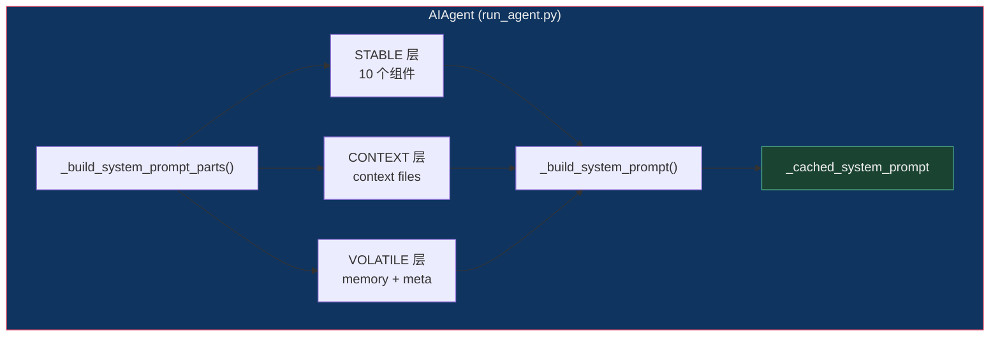
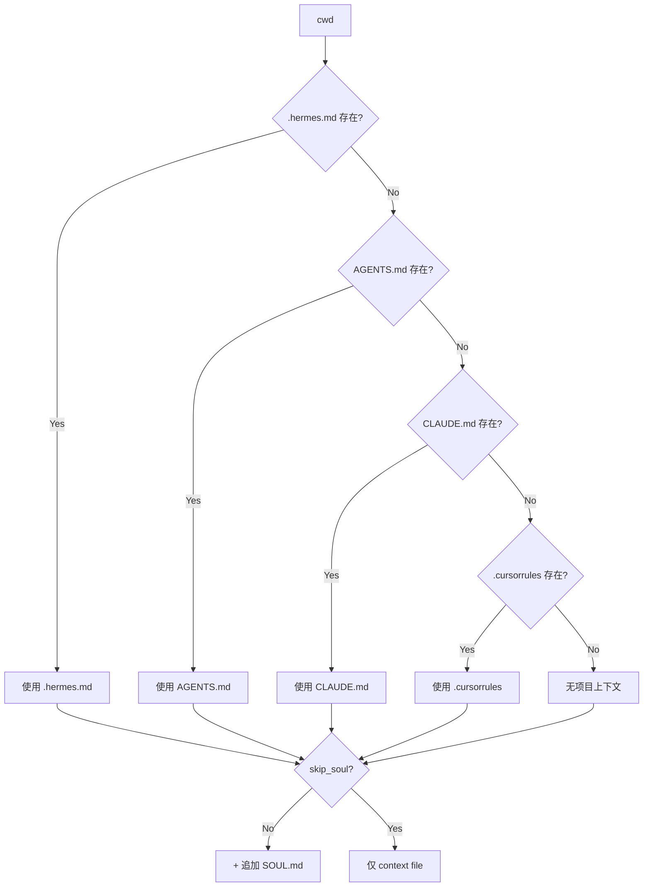
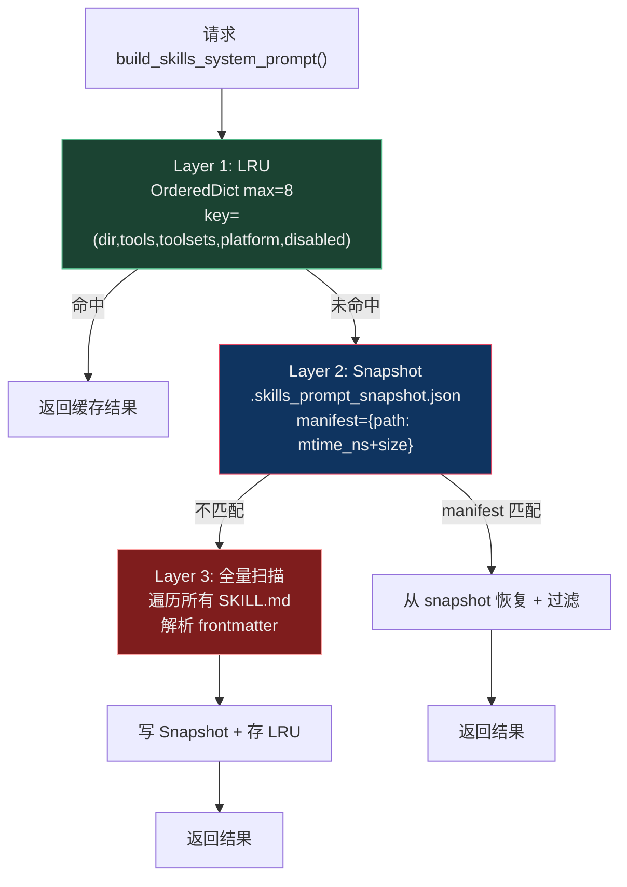
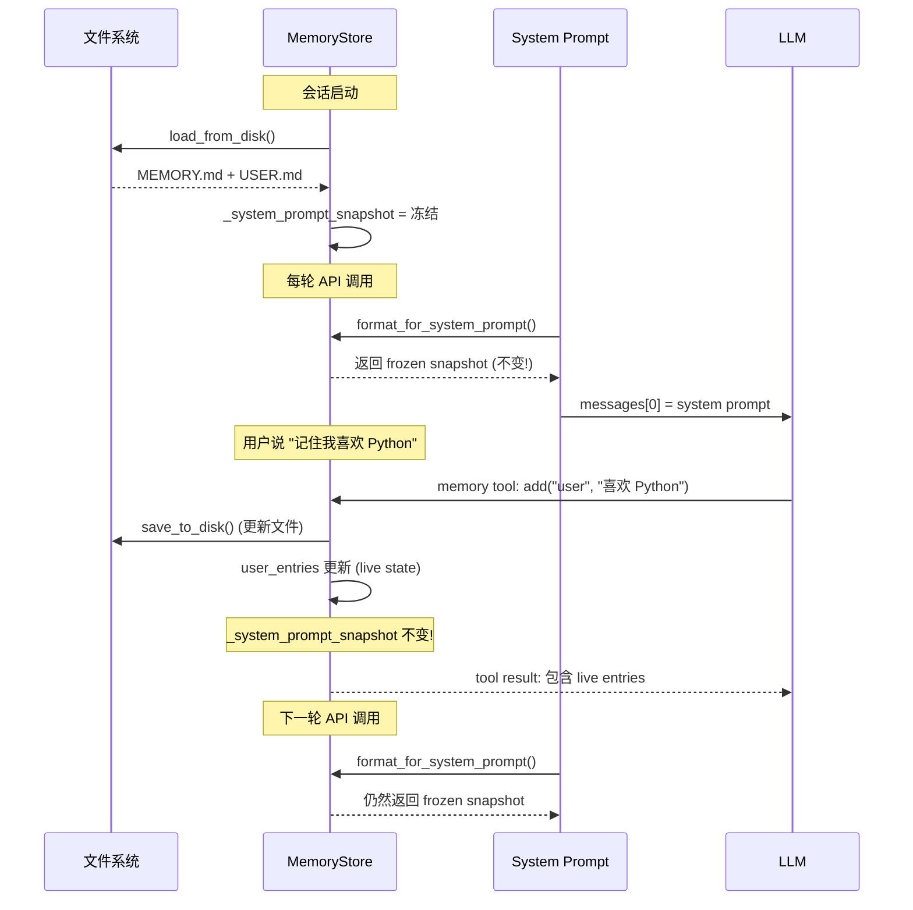
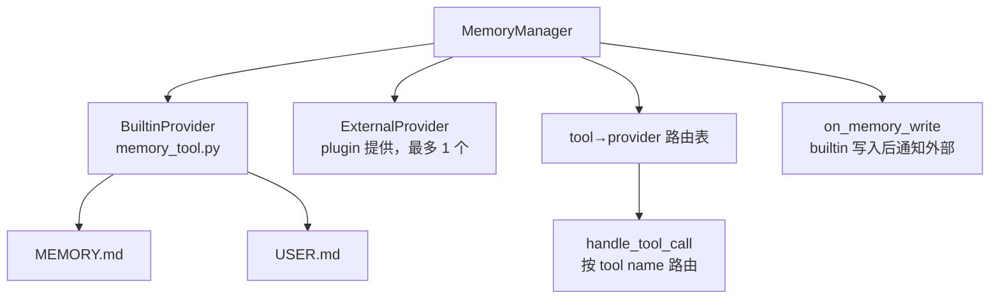

# Prompt Assembly：从文件系统到 LLM System Prompt 的完整旅程


## 核心结论

Hermes 的 system prompt 由 **三层 Tier** 组装而成：**stable**（会话级不变，缓存友好）→ **context**（项目级文件，互斥加载）→ **volatile**（memory 快照 + 元信息）。整个 system prompt 在会话中**只构建一次**，冻结后由 `_cached_system_prompt` 缓存，其核心设计目标是**最大化 Anthropic/OpenAI 的 prompt cache 命中率**——为此，memory 写入采用 **Frozen Snapshot Pattern**：mid-session 的 memory 更新只修改磁盘文件和 live state，不回写到 system prompt，LLM 通过 tool result 而非 system prompt 层面感知 memory 变化。

Skills 是 prompt 中最重的部分（数百个文件），采用**三层缓存**（进程内 LRU → 磁盘 Snapshot → 全量扫描）来优化启动性能。Skill 的运行时加载（`/skill` 命令）作为 **USER message** 注入对话，而非写入 system prompt，从而保持前缀缓存稳定。

## 推荐阅读路径

1. **`agent/prompt_builder.py:1417` `build_context_files_prompt()`** → 理解 context file 互斥加载链（.hermes.md > AGENTS.md > CLAUDE.md > .cursorrules），这是入口
2. **`agent/prompt_builder.py:988` `build_skills_system_prompt()`** → 理解 skills 三层缓存和过滤流水线，这是最复杂的函数
3. **`agent/prompt_caching.py`** → 只有 79 行，理解 Anthropic cache_control 的 4 断点布局
4. **`tools/memory_tool.py` `MemoryStore` 类** → 理解 Frozen Snapshot Pattern，核心是 `format_for_system_prompt()` 返回冻结快照
5. **`agent/memory_manager.py`** → 理解 MemoryManager 如何协调 builtin + 外部 provider
6. **`agent/skill_utils.py`** → 理解 skill 发现、frontmatter 解析、平台过滤
7. **`agent/skill_commands.py`** → 理解 `/skill` 运行时命令和 skill 消息的 7 层组装

## 重难点清单

| # | 难点 | 源码位置 | 难度 | 说明 |
|---|------|---------|------|------|
| 1 | Frozen Snapshot Pattern | `memory_tool.py` `format_for_system_prompt()` | ★★★ | system prompt 中的 memory 是会话启动时的冻结快照，mid-session 写入不回写。这是理解整个缓存策略的关键 |
| 2 | 三层 Tier 分组 vs 单次构建的矛盾 | `run_agent.py:5920-6048` | ★★★ | stable/context/volatile 三层听起来像每轮动态组合，实际上整个 system prompt 只构建一次。volatile 层在会话期间完全不变——命名有误导性 |
| 3 | Skills 三层缓存流水线 | `prompt_builder.py:988-1219` | ★★★ | LRU(8 slots) → 磁盘 Snapshot(mtime+size manifest) → 全量扫描，需要理解何时命中、何时失效 |
| 4 | Skill 条件激活规则 | `prompt_builder.py:957-985` | ★★ | fallback_for_toolsets vs requires_toolsets 的反向语义：前者在主工具可用时隐藏，后者在必需工具不可用时隐藏 |
| 5 | Context file 互斥加载 | `prompt_builder.py:1417-1456` | ★★ | .hermes.md > AGENTS.md > CLAUDE.md > .cursorrules，第一个非空胜出。但 SOUL.md 是独立追加的 |
| 6 | Skill 消息的 7 层组装 | `skill_commands.py` `_build_skill_message()` | ★★ | 模板变量替换 → inline shell → 路径注入 → 配置注入 → setup 提示 → supporting files → 用户指令 |
| 7 | Memory Nudge 后台审查 | `run_agent.py:12029-12035` | ★★ | 每 N 轮自动 fork 一个 AIAgent 审查 memory，共享 store 但独立对话 |
| 8 | 外部 Skills 目录的 mtime 缓存 | `skill_utils.py` `get_external_skills_dirs()` | ★★ | 用 (config_path, mtime_ns) 做缓存键，stat ~2μs vs YAML ~85ms，120 个 skill 启动时的性能关键 |
| 9 | Anthropic cache 断点布局 | `prompt_caching.py:apply_anthropic_cache_control()` | ★ | system 消息 + 尾部 3 条消息，共 4 个断点，全部共享相同 TTL |

## 设计意图（Why）

### 为什么 system prompt 只构建一次？

Anthropic 和 OpenAI 的 prompt cache 机制都是基于**前缀匹配**的——如果 messages[0]（system prompt）不变，大量 token 可以从缓存直接命中，跳过处理，成本降低 ~75%。如果 system prompt 每轮都变，缓存永远无法命中。

代价是：同一 session 内，memory 更新对 LLM 的"认知"只通过 tool result 传递，而非 system prompt 层面的持久注入。这是一个经过权衡的架构决策。

### 为什么 context file 互斥加载？

防止多个项目指导文件（AGENTS.md / CLAUDE.md / .cursorrules / .hermes.md）内容冲突。用户只需维护一个。.hermes.md 优先级最高——这是 Hermes 原生格式，同时兼容其他 AI 助手的配置。

### 为什么 Skill 作为 USER message 注入？

`/skill` 命令加载的 skill 内容作为 user message 注入对话（而非 system prompt），这样不会破坏 system prompt 前缀缓存。skill 的**索引**（名称 + 描述列表）在 stable 层，而 skill 的**完整内容**在 user 层——这是索引与内容的分离设计。

### 为什么用 Frozen Snapshot 而非 live state？

如果 format_for_system_prompt() 返回 live state，那么每次调用返回的内容可能不同（因为 memory 可能被写入），导致 system prompt 无法缓存。Frozen Snapshot 保证了幂等性。

---

## 一、Prompt Assembly 在架构中的角色



Prompt Assembly 是 AIAgent 主循环（Phase 3）的**前置阶段**。在每条 LLM API 调用中，system prompt 从缓存中取出，拼接在 `messages[0]`。

**上游调用者**：`AIAgent._build_system_prompt_parts()` → `prompt_builder` 各函数
**下游消费者**：`AIAgent.run_conversation()` → 组装 messages → 发给 Provider API

## 二、System Prompt 的三层结构

### 2.1 STABLE 层 — 会话级不变（缓存核心）

由 `run_agent.py:5920-6048` 组装，包含 10 个组件：

| # | 组件 | 来源 | 说明 |
|---|------|------|------|
| 1 | SOUL.md | `load_soul_md()` | Agent 身份定义，最高优先级 |
| 2 | Help Guidance | 常量 `HERMES_AGENT_HELP_GUIDANCE` | 指向 hermes-agent skill |
| 3 | Tool 感知指导 | 条件注入 | memory/session_search/skill_manage/kanban 各自的 GUIDANCE |
| 4 | Computer Use | 条件注入 | 如有 computer_use 工具 |
| 5 | Nous 订阅 | `build_nous_subscription_prompt()` | 托管 API key 功能提示 |
| 6 | Model 族指导 | 条件注入 | TOOL_USE_ENFORCEMENT + Google/OpenAI 特定指导 |
| 7 | **Skills 索引** | `build_skills_system_prompt()` | ★ 最重组件，包含所有可见 skill 的名称和描述 |
| 8 | Alibaba 修正 | 条件注入 | provider=="alibaba" 时的身份修正 |
| 9 | 环境提示 | `build_environment_hints()` | OS、cwd、remote backend 信息 |
| 10 | 平台提示 | `PLATFORM_HINTS[platform]` | 平台特定渲染指导 |

### 2.2 CONTEXT 层 — 项目级文件（互斥加载）

由 `build_context_files_prompt()` 组装：



**搜索范围**：
- `.hermes.md`：从 cwd 向上搜索到 git root（不超出仓库边界）
- `AGENTS.md` / `CLAUDE.md`：仅在 cwd 直接查找（不递归）
- `.cursorrules`：cwd + `.cursor/rules/*.mdc`（多文件合并）

### 2.3 VOLATILE 层 — 元信息（命名有误导性）

| # | 组件 | 来源 | 实际行为 |
|---|------|------|---------|
| 1 | Memory 快照 | `MemoryStore.format_for_system_prompt("memory")` | 返回 frozen snapshot，会话期间不变 |
| 2 | User profile | `MemoryStore.format_for_system_prompt("user")` | 同上 |
| 3 | 外部 provider 块 | `MemoryManager.build_system_prompt()` | 外部 memory provider 的 prompt |
| 4 | 元信息行 | 时间戳 + Session ID + Model + Provider | 仅构建时写入一次 |

> **注意**：虽然命名为 "volatile"，这一层在会话期间也**完全不变**。三层的实际语义更接近于"组件分组"而非"缓存策略分层"。

## 三、Skills 系统的完整生命周期

### 3.1 从磁盘到 System Prompt（索引阶段）


### 3.2 三层缓存架构



### 3.3 Skill 的运行时加载（/skill 命令）

当用户执行 `/gif-search hello` 时：

1. `resolve_skill_command_key("gif-search")` → 查找注册的 `/gif-search`
2. `_load_skill_payload()` → 调用 `skills_tool.skill_view()` 加载完整内容
3. `_build_skill_message()` → **7 层组装**：

| 层 | 操作 | 说明 |
|----|------|------|
| 1 | 模板变量替换 | `${HERMES_SKILL_DIR}` → 实际路径 |
| 2 | Inline shell 展开 | `` !`cmd` `` → bash 执行结果（默认关闭） |
| 3 | 路径注入 | `[Skill directory: ...]` |
| 4 | 配置注入 | `_inject_skill_config()` → 解析 config.yaml |
| 5 | Setup 提示 | setup_skipped/setup_needed/gateway_setup_hint |
| 6 | Supporting files | 扫描 references/templates/scripts/assets/ |
| 7 | 用户指令 | 追加 user_instruction 和 runtime_note |

4. 最终字符串作为 **USER message** 注入对话（不是 system prompt）

### 3.4 SKILL.md Frontmatter 字段

```yaml
---
name: skill-name                    # 唯一标识，缺失用目录名
description: 简短描述               # 60 字符截断
platforms: [macos, linux, windows]  # 平台过滤，空=全平台
metadata:
  hermes:
    requires_toolsets: [terminal]   # 需要这些 toolset 才可见
    requires_tools: [web_search]    # 需要这些 tool 才可见
    fallback_for_toolsets: [...]    # 当这些 toolset 不可用时作为备选
    fallback_for_tools: [...]       # 当这些 tool 不可用时作为备选
    config:                         # 声明的配置变量
      - key: wiki.path
        description: Wiki 路径
        default: ~/wiki
        prompt: 请输入 Wiki 路径
---
```

## 四、Memory 系统

### 4.1 Frozen Snapshot Pattern



### 4.2 MemoryManager 架构



### 4.3 Memory Nudge 机制

当用户连续 `_memory_nudge_interval` 轮（默认 10）未主动写 memory 时，系统自动 fork 一个后台 AIAgent 审查对话并决定是否更新 memory。这个 fork 共享主 session 的 `_memory_store`，但使用独立对话上下文。

## 五、安全扫描

### 5.1 Context File 安全扫描

`_scan_context_content()` 在所有 context file 加载前执行：
- **不可见 Unicode**：零宽空格、BOM、方向控制符等 10 种
- **10 个威胁模式**：prompt injection、role hijack、密钥泄露、HTML 注入等
- 命中任一 → 返回 `[BLOCKED: ...]` 替代内容（不抛异常，agent 仍能工作）

### 5.2 Memory 安全扫描

`_scan_memory_content()` 在 memory 写入前执行：
- 不可见 Unicode 检测
- 13 个正则模式（比 context file 更严格，额外包含 SSH backdoor、role hijack 等）

## 六、Anthropic Prompt Cache 策略

`prompt_caching.py` 的 `apply_anthropic_cache_control()`：

```
messages[0]  (system)         → cache_control breakpoint #1
...history...
messages[-3]                  → breakpoint #2
messages[-2]                  → breakpoint #3
messages[-1] (最新)            → breakpoint #4
```

- 最多 4 个断点（Anthropic 限制）
- 全部共享相同 TTL（5m 或 1h）
- `deepcopy` 操作，不修改原始 messages

## 七、关键源码文件

| 文件 | 行数 | 职责 |
|------|------|------|
| `agent/prompt_builder.py` | 1456 | 核心 prompt 组装（context files + skills + environment hints） |
| `agent/prompt_caching.py` | 79 | Anthropic cache_control 断点布局 |
| `agent/skill_commands.py` | 501 | /skill 运行时命令、skill 消息组装 |
| `agent/skill_utils.py` | ~550 | Skill 发现、frontmatter 解析、平台过滤 |
| `agent/skill_preprocessing.py` | ~130 | 模板变量替换、inline shell 展开 |
| `agent/memory_manager.py` | 555 | Memory provider 协调、tool 路由 |
| `agent/memory_provider.py` | 279 | MemoryProvider 抽象基类 |
| `tools/memory_tool.py` | 586 | MemoryStore 实现、Frozen Snapshot |
| `run_agent.py:5920-6100` | ~180 | `_build_system_prompt_parts()` 三层组装 |

---

本次回答了：Hermes 如何将 SOUL.md / MEMORY / skills / context files 组装成 LLM 的 system prompt，以及三层 Tier 架构、Frozen Snapshot Pattern、Skills 三层缓存的设计动机。
