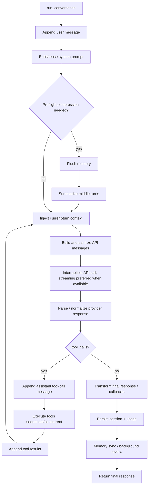

# Agent Turn Lifecycle

目标：用切片方式理解 `AIAgent.run_conversation()` 的主路径，不线性精读整个 `run_agent.py`。

相关源码：

- `run_agent.py`
- `model_tools.py`
- `agent/context_compressor.py`
- `agent/prompt_caching.py`
- `hermes_state.py`

关键不变量：

- API messages 发送前要修复/清理 provider 不接受的字段。
- 有 tool call 时，需要先 append assistant tool-call message，再 append tool results，不能拆坏 tool pair。
- streaming 是常见优先路径，但最终仍要汇合到 normalized assistant message 和内部 messages。
- persistence 发生在私有 retry/fallback 完成之后，避免把失败中间态写成正式历史。

下一次继续：

- 从 `run_agent.py::run_conversation()` 的 API message 构造和 tool-call branch 开始做更细切片。
