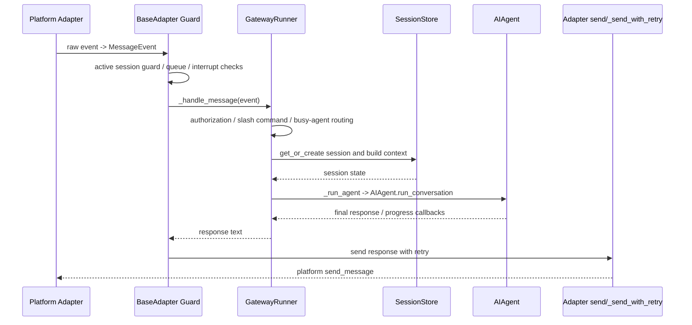

# Gateway Internals

目标：理解 Gateway 如何把平台消息转换为 Hermes agent turn，并明确 ordinary inbound response 不走 `DeliveryRouter`。

相关源码：

- `gateway/platforms/base.py`
- `gateway/run.py`
- `gateway/session.py`
- `gateway/delivery.py`
- `gateway/platforms/api_server.py`
- `gateway/platforms/webhook.py`

关键不变量：

- Gateway 有 adapter-level active-session/pending-message guard，也有 runner-level running-agent guard。
- 普通平台消息由 `BasePlatformAdapter._process_message_background()` 拿到 `GatewayRunner._handle_message()` 返回值后，通过 adapter 自身 `_send_with_retry()` / `send()` 发回平台。
- `gateway/delivery.py` 的 `DeliveryRouter` 是 outbound/cross-platform delivery 能力，不是普通 inbound message 的最终回复路径。
- A2A 如果走 Gateway adapter 路线，要复用 routing、authorization、session guard；如果走 ACP-like 独立 adapter，要自己实现 task/session/auth/event bridge。

下一次继续：

- 从 `gateway/run.py::_handle_message_with_agent` 和 `_run_agent` 继续，补 Gateway context 到 `AIAgent.run_conversation()` 的参数映射。
