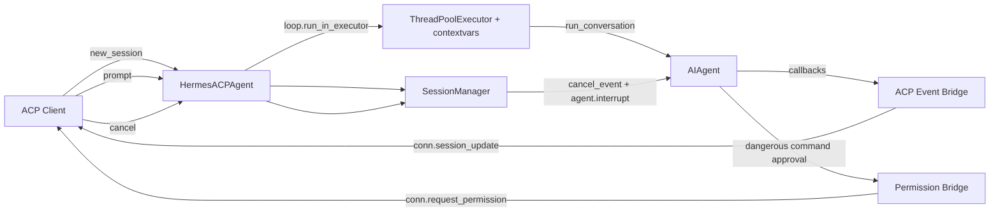

# ACP Adapter

目标：把 ACP 作为 A2A 的最近参考实现，理解 async 协议服务如何包装同步 `AIAgent`。

相关源码：

- `acp_adapter/server.py`
- `acp_adapter/session.py`
- `acp_adapter/events.py`
- `acp_adapter/permissions.py`
- `acp_adapter/auth.py`
- `toolsets.py`

关键不变量：

- Worker thread 中运行同步 `AIAgent`；协议事件回到 main event loop。
- Event bridge 用 callback 把 agent progress 转成协议可见 update。
- Permission bridge 不能绕过 Hermes 现有危险命令审批。
- Cancel 同时需要 task/session 状态和 `agent.interrupt()`。

对 A2A 的启发：

- streaming/cancel/permission bridge 应优先复用 ACP 的线程池、event callback、permission callback 思路。
- A2A 仍需要自己的 task/context 状态机；不能直接把 ACP session id 当作 A2A task id。
