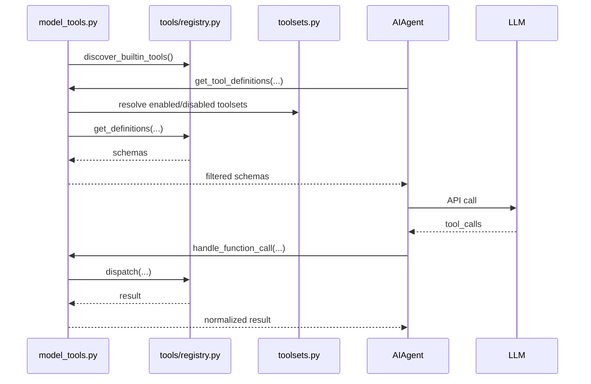
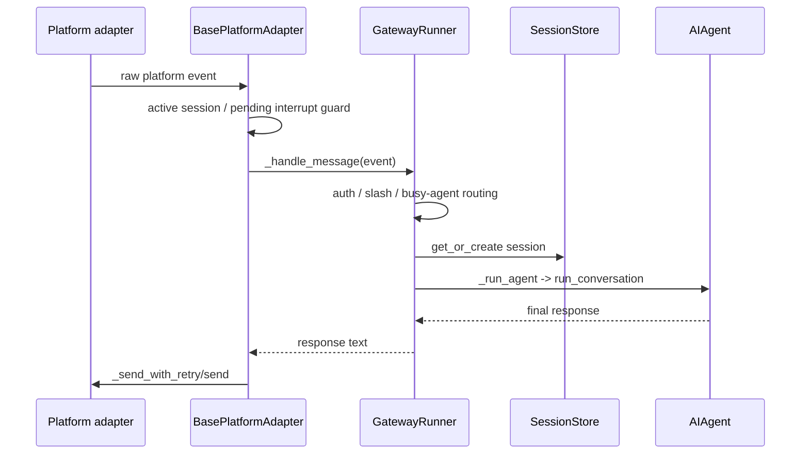

# Diagram Source Alignment Notes

目标：记录 standalone 图示曾经如何与 Hermes-agent upstream 源码对齐，并说明这些图迁移到主题笔记后的 canonical 位置。

当前约定：可视化是 source/design 笔记中的表达形式，不再作为独立知识分类维护。旧 `docs/diagrams/*.md` 内容已迁移到 `notes/source/` 或 `notes/design/`，`docs/diagrams/README.md` 只保留旧路径索引。

## 修正摘要

| 原图 | 当前 canonical 位置 | 结论 | 源码依据 |
| --- | --- | --- | --- |
| `00-hermes-system-map.md` | `notes/source/00-architecture-overview.md` | 顶层图基本可用，但需要显示 API Server adapter，并把 tool definitions/dispatch 标到 `model_tools.py`。 | `SOURCE_MAP.md` 将 Gateway API Server、`model_tools.py`、registry 分为不同入口。 |
| `01-tool-dispatch-flow.md` | `notes/source/01-tool-system-full-chain.md` | 原图把 `AIAgent` 画成直接访问 registry，实际中间层是 `model_tools.py`。 | `model_tools.py:30`/`:180` 触发 discovery，`:271` `get_tool_definitions()`，`:697` `handle_function_call()`；`tools/registry.py:57` discovery，`:234` register，`:320` get_definitions，`:373` dispatch。 |
| `02-prompt-layers.md` | `notes/source/02-prompt-assembly.md` | 原图的 Honcho static block 不成立；项目上下文是 first-match priority；ephemeral 层应和 cached system prompt 分开。 | `run_agent.py:5901` `_build_system_prompt_parts()`，`:6053` 说明 ephemeral 不在 cached parts，`:6109` `_build_system_prompt()`；`agent/prompt_builder.py:1417` `build_context_files_prompt()`；`toolsets.py:233` 标注 Honcho toolset removed。 |
| `03-agent-turn-lifecycle.md` | `notes/source/03-agent-turn-lifecycle.md` | 原图方向正确，但漏了 API message sanitize、streaming preferred、assistant tool-call message append、background sync/review。 | `run_agent.py:12458` strict API tool-call sanitize，`:12693` streaming preferred，`:14714` tool_calls branch，`:14945` `_execute_tool_calls()`，`:15473` persist session。 |
| `05-gateway-message-flow.md` | `notes/source/05-gateway-internals.md` | 原图最大偏差：普通回复不走 `DeliveryRouter`。 | `gateway/platforms/base.py:2812` `handle_message()`，`:3007` `_process_message_background()`，`:3533` `has_pending_interrupt()`；`gateway/run.py:5683` `_handle_message()`，`:7024` `_handle_message_with_agent()`，`:14323` `_run_agent()`，`:15510` `run_conversation()`。 |
| `06-acp-bridge-flow.md` | `notes/source/06-acp-adapter.md` | 基本对齐，只需要明确 executor、`conn.session_update`、`conn.request_permission`。 | `acp_adapter/server.py:85` executor，`:445` `HermesACPAgent`，`:930` `new_session()`，`:994` `cancel()`，`:1071` `prompt()`，`:1249` `run_conversation()`，`:1283` `run_in_executor()`；`acp_adapter/events.py:35` `run_coroutine_threadsafe(conn.session_update)`；`acp_adapter/permissions.py:87` `make_approval_callback()`。 |
| `08-a2a-hermes-mapping.md` | `notes/design/a2a-hermes-mapping.md` | 内容只能作为目标设计，不能标成已存在模块。 | upstream 当前没有 `a2a_adapter/`。 |

## 关键调用链

### Tool definitions and dispatch

### Gateway ordinary inbound response

## 对 A2A 的影响

- AgentCard 阶段不要暴露 prompt、memory、raw reasoning、credentials、完整内部工具表；只能暴露能力摘要和安全过滤后的 metadata。
- task/session mapping 不能只看 `SessionDB`，还要参考 Gateway 的 active-session/pending-interrupt guard，以及 ACP `SessionManager` 的 cancel model。
- non-stream message send 如果走 Gateway-style adapter，需要复用 `_handle_message` 的 auth/session/slash/busy 语义；如果走 ACP-style 独立 adapter，需要自己补这些边界。
- streaming/cancel/permission 最适合先参考 ACP adapter，因为那里已有 executor、event callback、permission bridge、`agent.interrupt()` 的组合。

## 下一次应该继续

从 `/home/shq/opensource/hermes-agent/gateway/run.py::_handle_message_with_agent` 和 `_run_agent` 继续，补一张“Gateway context -> AIAgent.run_conversation 参数”的细图，并验证哪些字段适合映射到 A2A task/session metadata。
