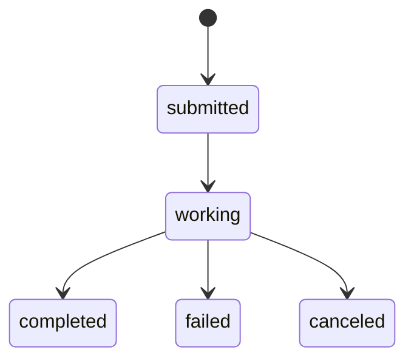

# A2A Task Mapping Draft

## Mapping table

| A2A field | Hermes source | Notes |
|---|---|---|
| `task.id` | generated UUID | Do not expose internal session id |
| `task.contextId` | mapping table | Logical multi-turn context |
| `status.state` | task manager state | Map callbacks and terminal states |
| `artifacts[].parts[]` | final response / file refs | Do not expose private file paths |

## State transitions

## Persistence options

### Option A: in-memory MVP

Pros:

Cons:

### Option B: new SQLite table next to SessionDB

Pros:

Cons:

### Option C: encode in existing SessionDB metadata

Pros:

Cons:

## Security implications

## Tests

