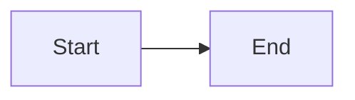

# Session Log: {{title}}

Date: {{date}}
Branch:
Hermes commit/version:

## Goal


## Source touched

- `path/to/file.py::symbol`

## What I learned


## Call chain / flow



## Verification

Command/test/script:

```bash

```

Result:

## Questions


## Next commit

```bash
git add .
git commit -m "docs(scope): short description"
```
