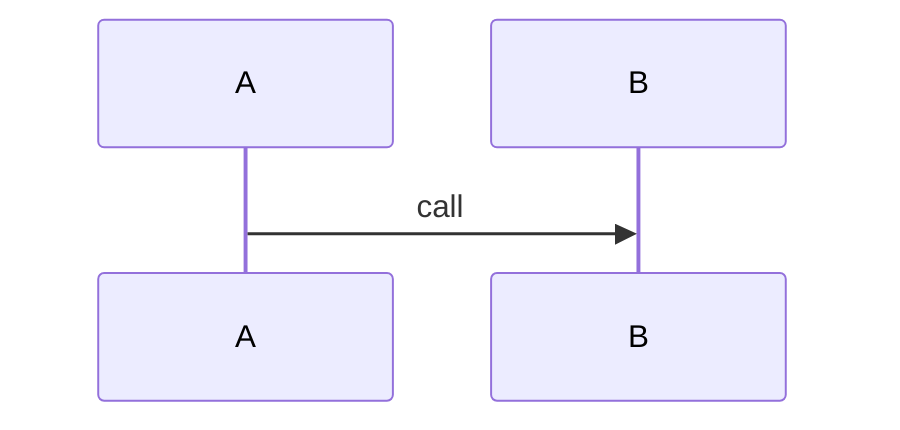

# Source Reading Note: {{title}}

## Why this file matters

## Entry points

## Key data structures

## Key functions/classes

| symbol | role | risk |
|---|---|---|
| `X` |  |  |

## Call chain

## Invariants

- 

## Failure modes

- 

## Tests to inspect

- `tests/...`

## Contribution implications

## A2A relevance

